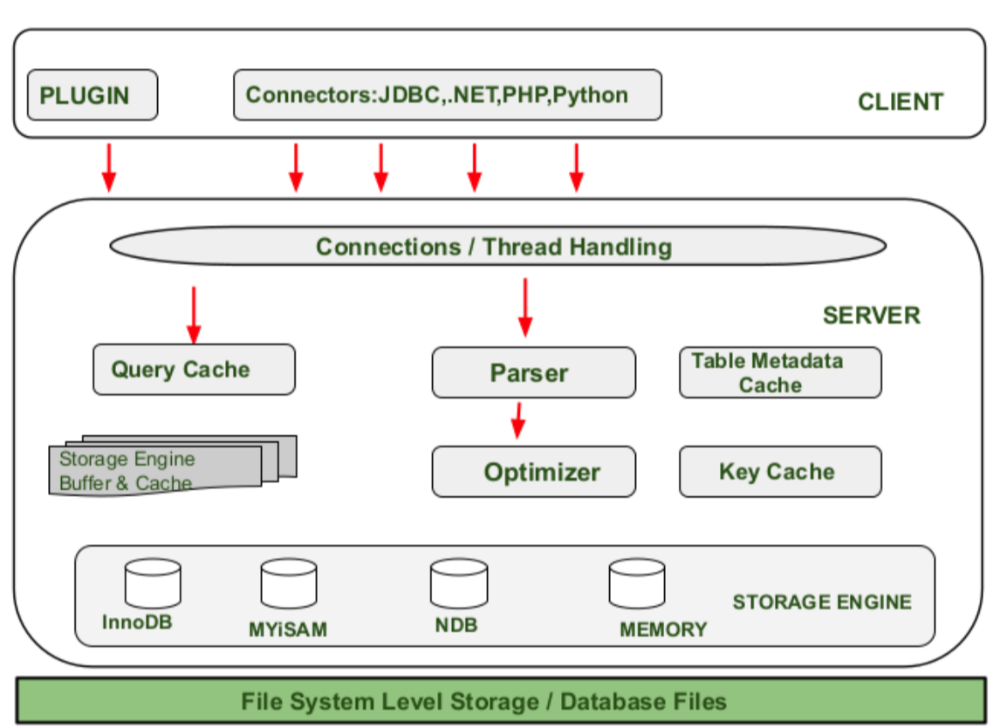
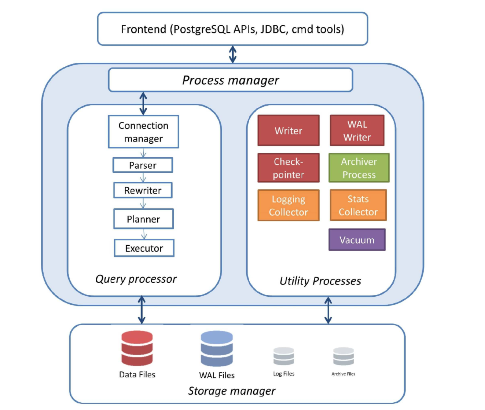
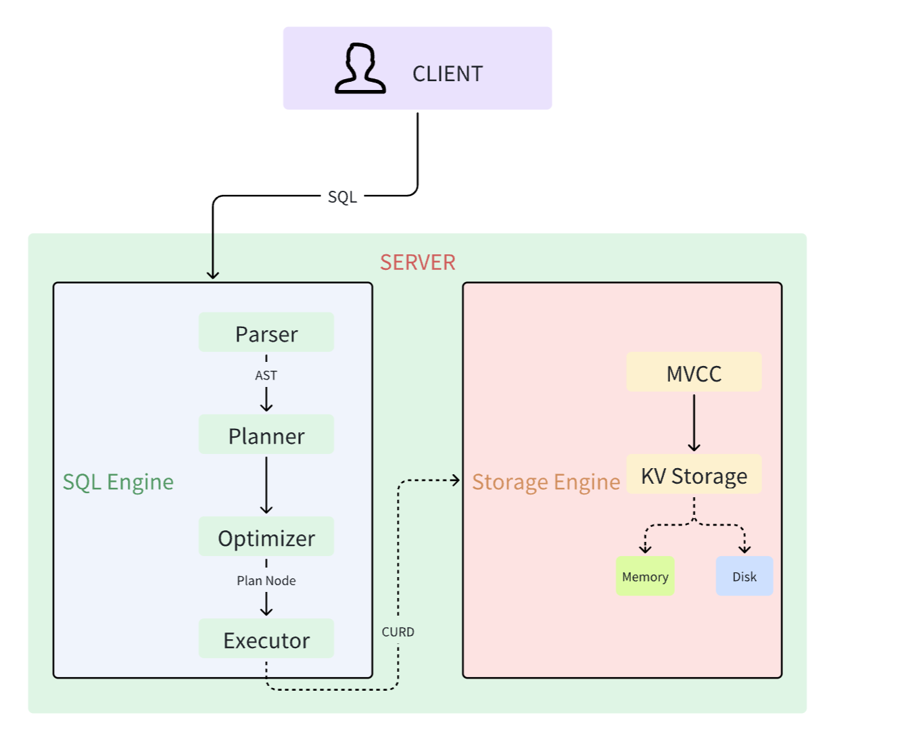

# 数据库大致架构

## Parser 解析器

SQL语句本身是文本数据（字符串），数据库接收SQL语句时需要进行解析，比如验证合法性、**语法是否正确**等。最后，会生成抽象语法树。

## Planner 执行计划

**树状**表示执行计划，如下所示，假如我们有如下sql：

```sql
SELECT *
FROM orders o
JOIN customers c ON o.customer_id = c.customer_id
WHERE o.order_date > '2024-01-01';
```

它的简要树形执行计划如下所示：

```
             JOIN
     /                    \
 Filter(order_date)     Scan(customers)
    |
 Scan(orders)
```

## Optimizer 优化器

负责根据执行计划生成的各种执行路径，**分析并选择最优的路径**，即在保证结果正确的情况下，尽可能降低成本（CPU、内存、IO等的消耗）

## Executor 执行器

执行执行计划中的各个节点，有`push模型`和`pull模型`。

例如，常见的开源MySQL数据库中，采用了基于pull的火山模型，即从最顶层的节点开始执行，不断地拉取（pull）下层节点的执行结果，直到完全执行，并返回正确结果。

## Transaction 事务

事务管理器负责实现事务的ACID属性，以及基本的提交、回滚、处理冲突等操作。

## Storage 存储引擎

负责数据存储和检索的组件，负责将逻辑数据存储在物理介质中，并向上提供访问接口。

通常，存储引擎还会包括内存的Buffer管理和磁盘的数据Page组织。

# MySQL架构图



# PostgreSQL架构图



# 简易的SQL架构图



- Client：接收并分发用户的sql请求。
- Server：处理sql语句，返回正确结果。
  - 自顶向下处理sql语句：Parser -> Planner -> Optimizer -> Executor -> Storage(MVCC) - Transaction 
  - KV Storage（内存+磁盘）- 持久化
- 基础sql：`create`、`insert`、`select` => 其他高级语句、事务等