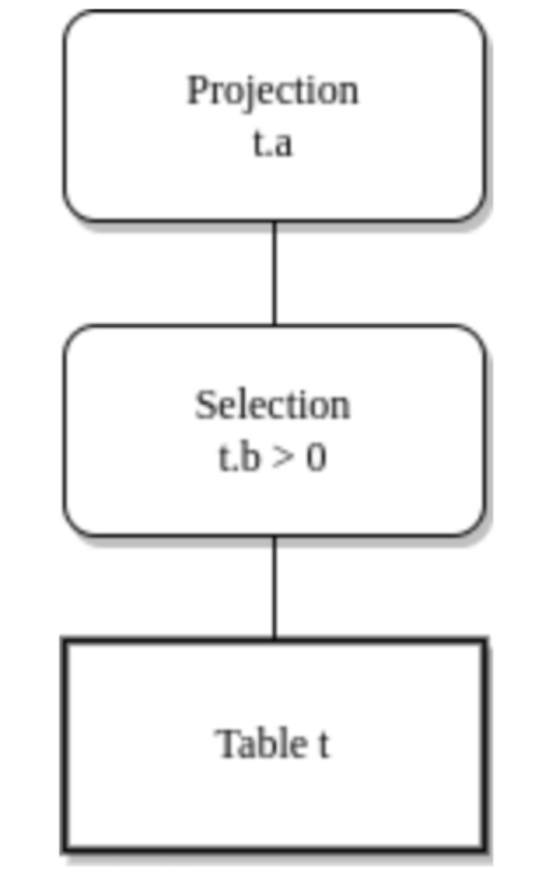

# 解析器Lexer的实现

用户发出sql语句（字符串），首先抵达的就是解析器部分。解析器会将传入的字符串，按照预设的sql语法规则进行解析，并生成抽象语法树（AST，Abstract Syntax Tree）。

对于sql语句的AST，我们可以参见下例：

- 现在我们有简单sql：`select a from t where b>0;`
- 那么，该sql的AST会如下图所示：



- 词法分析一般调第三方库即可，目前主流的工具有：lex，yacc，flex，bison等。
  - 我们实现一个简单lexer。

## 词法分析——Lexer原理

sql语句 => 可连续读取的token，token会提供给parser进行分析，最后再生成AST。**注意：lexer仅负责解析，不负责解释具体的含义**。例如，无法识别`create table（关键字） table（表名）`

即：sql -> lexer -> token -> parser -> AST

- 例如，现在有语句：`3.14 + update('abc')`，我们作如下分解：

```
Token::Number("3.14")
清除空格
Token::Plus
清除空格
Token::Keyword(Keyword::Update)
Token::String("abc")
```

- 可见，lexer会将sql中的空白字符清除，并识别出sql中的数字、字符串、关键字等。此外还会进行一些最基本的预处理，比如明显的语法错误和不识别的关键字。

我们先实现最简单的sql语句（create、insert、select），它们的基本语法如下所示：

```sql
词法分析 Lexer 定义
目前支持的 SQL 语法

1. Create Table
CREATE TABLE table_name (  -- 表名
    [ column_name data_type [ column_constraint [...] ] ]  -- 列名 列类型 列约束
    [, ... ]
   );

   -- 列类型目前先支持：bool、float(double)、int、string（text、varchar）
   where data_type is:
    - BOOLEAN(BOOL): true | false
    - FLOAT(DOUBLE)
    - INTEGER(INT)
    - STRING(TEXT, VARCHAR)

   -- 列约束目前先支持：是否可以为空、是否有默认值
   where column_constraint is:
   [ NOT NULL | NULL | DEFAULT expr ]

2. Insert Into
INSERT INTO table_name        -- 表名
[ ( column_name [, ...] ) ]   -- 列名
values ( expr [, ...] );      -- 列数据

3. Select * From

-- 目前仅先支持select *
SELECT * FROM table_name;
```

## 代码实现

### 主逻辑

1. 先将`cargo new`创建的`main.rs`重命名为`lib.rs`，并清空所有内容，新增：`pub mod sql;`，声明自己所写模块。
2. 新建目录`src/sql/mod.rs`，声明所有自己写的模块：

```rust
pub mod parser;
```

3. 新建解析器目录`src/sql/parser/mod.rs 和 lexer.rs`。现在的目录结构如下所示：

```bash
(base) glk@ggg:~/project/my-sql-db/src$ tree .
.
├── lib.rs
└── sql
    ├── mod.rs
    └── parser
        ├── lexer.rs
        └── mod.rs

2 directories, 4 files
```

- 即主目录下的lib，子目录下的mod都是在共享代码模块

4. 在lexer.rs中写lexer的定义：

首先，我们从sql的基本语法中抽取出关键字和token，并进行定义：

```rust
// 对token和Keyword的定义
// 派生注解解释：Debug允许你用{:?}打印调试信息，Clone允许用.clone()创建复制体，PartialEq允许对两个结构体的所有属性进行比较
#[derive(Debug, Clone, PartialEq)]
pub enum Token {
    Keyword(Keyword),   // 关键字
    Ident(String),      // 表明、列名等特殊字符串
    String(String),     // 普通字符串
    Number(String),     // 数字（int、float等）
    OpenParen,          // (
    CloseParen,         // )
    Comma,              // ,
    Semicolon,          // ;
    Asterisk,           // *
    Plus,               // +
    Minus,              // -
    Slash,              // /
}

#[derive(Debug, Clone, PartialEq)]
pub enum Keyword {
    Create,
    Table,
    Int,
    Integer,
    Boolean,
    Bool,
    String,
    Text,
    Varchar,
    Float,
    Double,
    Select,
    From,
    Insert,
    Into,
    Values,
    True,
    False,
    Default,
    Not,
    Null,
    Primary,
    Key,
}


// word -> Keyword，区分关键字和表名、列名
impl Keyword {
  pub fn transfer(input: &str) -> Option<Self> {
    Some(
      match input.to_uppercase().as_ref() {  // as_ref() 将值转换为引用
        "CREATE" => Keyword::Create,
        "TABLE" => Keyword::Table,
        "INT" => Keyword::Int,
        "INTEGER" => Keyword::Integer,
        "BOOLEAN" => Keyword::Boolean,
        "BOOL" => Keyword::Bool,
        "STRING" => Keyword::String,
        "TEXT" => Keyword::Text,
        "VARCHAR" => Keyword::Varchar,
        "FLOAT" => Keyword::Float,
        "DOUBLE" => Keyword::Double,
        "SELECT" => Keyword::Select,
        "FROM" => Keyword::From,
        "INSERT" => Keyword::Insert,
        "INTO" => Keyword::Into,
        "VALUES" => Keyword::Values,
        "TRUE" => Keyword::True,
        "FALSE" => Keyword::False,
        "DEFAULT" => Keyword::Default,
        "NOT" => Keyword::Not,
        "NULL" => Keyword::Null,
        "PRIMARY" => Keyword::Primary,
        "KEY" => Keyword::Key,
        _ => return None,
      }
    )
  }
}
```

接着，定义lexer类：

```rust
use std::iter::Peekable;
use std::str::Chars;

// 实现简单的词法分析Lexer
// lexer 结构体包含 iter 元素，实现了peekable接口（非消耗地提前查看下一个字符），指定接收泛型为chars，生命周期为a
pub struct Lexer<'a> {
  iter: Peekable<Chars<'a>>  // chars 包含对多个 token 的引用，所以需要生命周期
}

impl<'a> Lexer<'a> {
  pub fn new(input: &'a str) -> Self {
    // 将传入的字符串 input 初始化为带 peekable 功能的字符迭代器 iter
    Self {
      iter: input.chars().peekable()
    }
  }

  // 隔离一些小方法，比如消除空格等
  // 消除空格，例如 select    *     from   t; 这也是有效的sql，我们的思路是利用迭代器一直查找下个字符，直到不为空格
  fn move_whitespace(&mut self){
    self.next_while(|c| c.is_whitespace());  // 注：这里的whitespace包括 空格,\n,\t等
    // 传参仅传condition闭包即可，&mut self 是隐式调用的
  }

  // 辅助方法
  // 判断当前字符a[i]是否满足条件，是则跳转到下一个字符a[i+1]，并返回该字符a[i]，否则返回None
  fn next_if<F: Fn(char) -> bool>                          // 泛型函数F：实现了接口Fn（像函数一样的闭包，可以被多次调用），指定了函数类型必须是 接收char返回bool
  (&mut self,condition: F) -> Option<char> {               // 接收参数condition：condition是F类型的函数或闭包
    self.iter.peek().filter(|&c| condition(*c))?; // 先探测 a[i] 是否满足条件（仅查看，不消耗）
    self.iter.next()                                     // 第一行代码执行成功，就执行这行代码。这里是iter不是peek，所以还会消耗该字符，返回a[i]
  }

  // 连续获取满足条件的字符，直到不满足为止
  fn next_while<F: Fn(char) -> bool>(&mut self, condition: F) -> Option<String> {
    let mut value = String::new();
    while let Some(c) = self.next_if(&condition) {
      value.push(c);
    }
    Some(value).filter(|s| !s.is_empty())  // 过滤空值
  }

  // 只有是token，才会返回当前token，并跳到下一个字符
  // 这里我们需要理解，如果遇到 +，那么 next_if 会返回 +，next_if_token会返回Token::Plus
  fn next_if_token<F:Fn(char) -> Option<Token>>(&mut self, condition: F) -> Option<Token>{
    let token = self.iter.peek().and_then(|c| condition(*c))?;
    // and_then 的效果是：如果 peek() 返回 Some(&char)，则对字符应用 condition，并尝试将其转换为 Option<Token>
    self.iter.next();
    Some(token)
  }

  // get next token
  fn scan(&mut self) -> Result<Option<Token>>{  // 扫描到的token可能为空，所以返回Option类型
    self.move_whitespace(); // 先消除多余空格，即变为 select * from t;

    // 由扫描到的第一个字符进行判断：
    match self.iter.peek(){
      Some('\'') => self.scan_string(),
      Some('"') => self.scan_string(),                   // 以单引号或者双引号打头的是字符串
      Some(c) if c.is_ascii_digit() => Ok(self.scan_number()),   // 数字
      Some(c) if c.is_alphabetic() => Ok(self.scan_word()),    // Ident、Keyword
      Some(_) => Ok(self.scan_symbol()),                                // 符号
      None => Ok(None),
    }
  }

  fn scan_string(&mut self) -> Result<Option<Token>> {
    // 不是单/双引号号开头
    if self.next_if(|c| c== '\'' || c=='"').is_none() {
      return Ok(None);
    }

    let mut value = String::new();
    loop {
      match self.iter.next() {
        Some('\'') => break,    // 匹配结束
        Some('"') => break,
        Some(c) => value.push(c),
        None => return Err(Error::Parse("[Lexer] Unexpected EOF of (String)".to_string()))
      }
    }
    Ok(Some(Token::String(value)))
  }

  fn scan_number(&mut self) -> Option<Token> {
    // 分部分扫描
    let mut num = self.next_while(|c| c.is_ascii_digit())?;  // ? 解包Option

    if let Some(sep) = self.next_if(|c| c=='.') {  // 小数点
      num.push(sep);
      // 小数点之后接着扫描
      while let Some(c) = self.next_if(|c| c.is_ascii_digit()) {
        num.push(c);
      }
    }
    Some(Token::Number(num))
  }

  fn scan_word(&mut self) -> Option<Token> {
    let mut val = self.next_if(|c| c.is_alphabetic())?.to_string();
    while let Some(c) = self.next_if(|c| c.is_alphanumeric() || c=='_') {  // alphanumeric是字母或数字
      val.push(c)
    }

    // 如果word是关键字，那么要转成关键字类型，否则为Ident类型
    Some(Keyword::transfer(&val).map_or(Token::Ident(val.to_lowercase()),   // map_or返回None
                                        Token::Keyword))                    // map_or返回Some
  }

  fn scan_symbol(&mut self) -> Option<Token> {
    self.next_if_token(|c| match c{
      '*' => Some(Token::Asterisk),
      '(' => Some(Token::OpenParen),
      ')' => Some(Token::CloseParen),
      ',' => Some(Token::Comma),
      ';' => Some(Token::Semicolon),
      '+' => Some(Token::Plus),
      '-' => Some(Token::Minus),
      '/' => Some(Token::Slash),
      _ => None,
    })
  }
}
```

这里我们简单对比一下peek,iter和into_iter:

| 方法         | 示例代码                     | 返回值              | 指针位置变化      | 集合所有权              |
|--------------|------------------------------|---------------------|-------------------|--------------------|
| `peek`       | `let iter = [1, 2, 3].iter().peekable();`<br>`iter.peek();` | `Some(&1)`       | 不变            | 保持所有权（数组还是[1,2,3]） |
| `iter`       | `let iter = [1, 2, 3].iter();`<br>`iter.next();` | `Some(&1)`       | 移动到 `2`      | 保持所有权（数组还是[1,2,3]） |
| `into_iter`  | `let iter = [1, 2, 3].into_iter();`<br>`iter.next();` | `Some(1)`        | 移动到 `2`      | 转移所有权（相当于变为[2,3]）  |


[理解Lexer工作原理](./02.5-ExplanationOfLexer.md)

注意，我们在根目录下先自定义了一个error.rs，相当于自己写Result的返回类型和错误类型，这是工程中常见做法：

```rust
// 自定义Result返回的错误类型
// 对标准的Result进行重写即可

pub type Result<T> = std::result::Result<T,Error>;

// 自定义错误类型
#[derive(Debug, Clone, PartialEq)]
pub enum Error{
  Parse(String), // 在解析器阶段报错，内容为String的错误
}
```

最后，我们为Lexer类实现标准迭代器接口，使得它能被for循环遍历：

```rust
// 标准迭代器接口
impl<'a> Iterator for Lexer<'a> {
    type Item = Result<Token>;   // 每次返回token/err

    fn next(&mut self) -> Option<Self::Item> {  // 要求实现的方法，返回每一步迭代的值（这里是token）
        match self.scan() {
            Ok(Some(token)) => Some(Ok(token)),   // 成功解析到token
            Ok(None) => // 解析返回None，但是确实有字符，说明字符不合法
                self.iter.peek().map(|c| Err(Parse(format!("[Lexer] Unexpected character {}", c)))),
            Err(e) => Some(Err(e)),
        }
    }
}
```

### 测试代码

写一些简单的单元测试：

```rust
#[cfg(test)]
mod tests{
    use super::*;
    use std::vec;
    use crate::{
        error::Result,
        sql::parser::lexer::{Keyword, Token},
    };


    #[test]
    fn test_lexer_create_table() -> Result<()> {
        let tokens1 = Lexer::new(
            "CREATE table tbl
                (
                    id1 int primary key,
                    id2 integer
                );
                ",
        )
            .peekable()  // 由于实现了标准迭代器接口，故可以使用peekable()
            .collect::<Result<Vec<Token>>>()?;

        println!("tokens1: {:?}", tokens1);

        assert_eq!(
            tokens1,
            vec![
                Token::Keyword(Keyword::Create),
                Token::Keyword(Keyword::Table),
                Token::Ident("tbl".to_string()),
                Token::OpenParen,
                Token::Ident("id1".to_string()),
                Token::Keyword(Keyword::Int),
                Token::Keyword(Keyword::Primary),
                Token::Keyword(Keyword::Key),
                Token::Comma,
                Token::Ident("id2".to_string()),
                Token::Keyword(Keyword::Integer),
                Token::CloseParen,
                Token::Semicolon
            ]
        );

        let tokens2 = Lexer::new(
            "CREATE table tbl
                        (
                            id1              int primary key,
                            id2 integer,
                            c1 bool null,
                            c2 boolean not null,
                            c3 float null,
                            c4 double,
                            c5 string,
                            c6 text,
                            c7 varchar default 'foo',
                            c8 int default 100,
                            c9 integer
                        );
                        ",
        )
            .peekable()
            .collect::<Result<Vec<Token>>>()?;

        println!("tokens2: {:?}", tokens2);

        assert!(tokens2.len() > 0);

        Ok(())
    }


    #[test]
    fn test_lexer_insert_into() -> Result<()> {
        let tokens1 = Lexer::new("insert into tbl values (1, '2', \"3\", true, false, 4.55);")
            .peekable()
            .collect::<Result<Vec<_>>>()?;

        assert_eq!(
            tokens1,
            vec![
                Token::Keyword(Keyword::Insert),
                Token::Keyword(Keyword::Into),
                Token::Ident("tbl".to_string()),
                Token::Keyword(Keyword::Values),
                Token::OpenParen,
                Token::Number("1".to_string()),
                Token::Comma,
                Token::String("2".to_string()),
                Token::Comma,
                Token::String("3".to_string()),
                Token::Comma,
                Token::Keyword(Keyword::True),
                Token::Comma,
                Token::Keyword(Keyword::False),
                Token::Comma,
                Token::Number("4.55".to_string()),
                Token::CloseParen,
                Token::Semicolon,
            ]
        );

        let tokens2 = Lexer::new("INSERT INTO       tbl (id, name, age) values (100, 'db', 10);")
            .peekable()
            .collect::<Result<Vec<_>>>()?;

        assert_eq!(
            tokens2,
            vec![
                Token::Keyword(Keyword::Insert),
                Token::Keyword(Keyword::Into),
                Token::Ident("tbl".to_string()),
                Token::OpenParen,
                Token::Ident("id".to_string()),
                Token::Comma,
                Token::Ident("name".to_string()),
                Token::Comma,
                Token::Ident("age".to_string()),
                Token::CloseParen,
                Token::Keyword(Keyword::Values),
                Token::OpenParen,
                Token::Number("100".to_string()),
                Token::Comma,
                Token::String("db".to_string()),
                Token::Comma,
                Token::Number("10".to_string()),
                Token::CloseParen,
                Token::Semicolon,
            ]
        );
        Ok(())
    }

    #[test]
    fn test_lexer_select() -> Result<()> {
        let tokens1 = Lexer::new("select * from tbl;")
            .peekable()
            .collect::<Result<Vec<_>>>()?;

        assert_eq!(
            tokens1,
            vec![
                Token::Keyword(Keyword::Select),
                Token::Asterisk,
                Token::Keyword(Keyword::From),
                Token::Ident("tbl".to_string()),
                Token::Semicolon,
            ]
        );
        Ok(())
    }
}
```