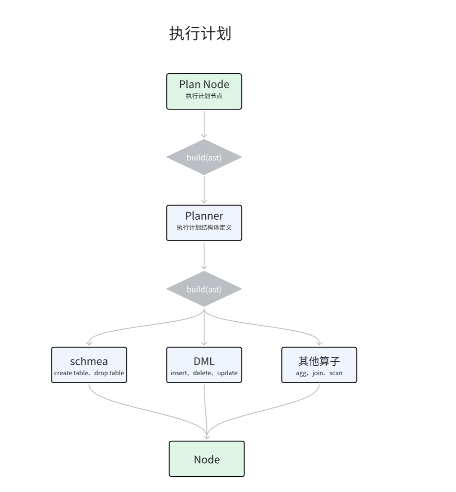

# Planner 执行计划

输入抽象语法树ast -> Planner -> 执行的物理计划，Planner是逻辑向物理的过渡。之后，Executor执行器会接收Planner的输出。

在[Parser](./03-Parser.md)中，我们会获得如下类似的抽象语法树：

```
CreateTable { 
name: "tbl1", 
columns: 
[Column { name: "a", datatype: Integer, nullable: None, default: Some(Consts(Integer(100))) }, 
Column { name: "b", datatype: Float, nullable: Some(false), default: None }, 
Column { name: "c", datatype: String, nullable: Some(true), default: None }, 
Column { name: "d", datatype: Boolean, nullable: None, default: Some(Consts(Boolean(true))) }
] 
}
```

在Planner中，我们将接收到的ast转为树形执行计划。

## 代码实现

1. 新建sql/planner文件夹，存放planner相关代码
- 新建mod.rs，书写代码。
- 现在sql/mod.rs变为了：

```rust
pub mod parser;
pub mod types;
pub mod planner;
```

2. 新建sql/schema.rs，用于定义各种模式（表等），这里需要注意，schema里定义的Table是整个数据库运作中会用到的。即Parser是接收外部，schema是内部运作。所以，我们要避免用到Parser阶段自定义的结构体和枚举等，以**解耦合**。

在sql/mod.rs中新增：

```rust
pub mod schema;
```

schema中定义：

```rust
use crate::sql::types::{DataType, Value};

#[derive(Debug, PartialEq)]
pub struct Table{
    pub name: String,
    pub columns: Vec<Column>,
}

#[derive(Debug,PartialEq)]
pub struct Column{
    pub name: String,
    pub datatype: DataType,
    pub nullable: bool,
    pub default: Option<Value>,
}
```

这里，`default`的类型如果和parser一样，则是`Option<Expression>`，但是我们要解耦，所以在sql/types/mod.rs新增value类型：

```rust
#[derive(Debug,PartialEq)]
pub enum Value {
    Null,
    Boolean(bool),
    Integer(i64),
    Float(f64),
    String(String),
}
```

顺便为其实现从Expression到Value的转换方法：

```rust
impl Value {
    pub fn from_expression_to_value(expression: Expression) -> Self{
        match expression {
            Expression::Consts(Consts::Null) => Self::Null,
            Expression::Consts(Consts::Boolean(bool)) => Self::Boolean(bool),
            Expression::Consts(Consts::Integer(int)) => Self::Integer(int),
            Expression::Consts(Consts::Float(float)) => Self::Float(float),
            Expression::Consts(Consts::String(string)) => Self::String(string),
        }
    }
}
```

3. 在planner/mod.rs中：

```rust
use crate::sql::parser::ast::{Expression, Sentence};
use crate::sql::planner::planner::Planner;
use crate::sql::schema::Table;

mod planner;

// 定义执行节点
#[derive(Debug,PartialEq)]
pub enum Node{
    CreateTable{
        schema: Table,
    },
    Insert{
        table_name: String,
        columns: Vec<String>,
        values:Vec<Vec<Expression>>  // 先暂时置为expression，后续再解析
    },
    Scan{
        // select
        table_name: String,
    }
}

// 定义执行计划，执行计划的底层是不同执行节点
// 多个Node节点组成了执行计划Plan树
#[derive(Debug,PartialEq)]
pub struct Plan(pub Node);  // 元素结构体，可以通过 let plan = Plan(node); 快速创建

// 实现构建Plan的方法
impl Plan{
    pub fn build(sentence: Sentence) -> Self{
        Planner::new().build(sentence)
    }
}
```

4. 新建planner/planner.rs

```rust
use crate::sql::parser::ast::Sentence;
use crate::sql::planner::{Node, Plan};
use crate::sql::schema;
use crate::sql::schema::Table;
use crate::sql::types::Value;

pub struct Planner;  // 辅助Plan的结构体

impl Planner {
    pub fn new() -> Self {
        Self
    }

    pub fn build(&mut self, sentence: Sentence) -> Plan{
        Plan(self.build_sentence(sentence))   // 新创建一个Plan并返回
    }

    // 将parser得到的sql-sentence转换为node节点
    fn build_sentence(&mut self, sentence: Sentence) -> Node{
        match sentence {
            Sentence::CreateTable {name,columns} =>
                Node::CreateTable {
                    schema:Table{
                        name,
                        columns:
                            columns.into_iter().map(|c| {
                                let nullable = c.nullable.unwrap_or(true); // nullable解包出来是None，说明可以为空
                                let default = match c.default {
                                    Some(expression) => Some(Value::from_expression_to_value(expression)),
                                    None if nullable => Some(Value::Null),  // 如果没写default且可为null，则默认null
                                    None => None,
                                };

                                schema::Column{
                                    name: c.name,
                                    datatype: c.datatype,
                                    nullable,
                                    default
                                }     // 相当于匿名函数，入参是c，返回schema
                            }).collect(),
                    }
                },

            Sentence::Insert { table_name, columns, values, } =>
                Node::Insert {
                    table_name,
                    columns:columns.unwrap_or_default(),  // columns 是 None 时，则使用 Vec::default()，即一个空的 Vec 列表，作为默认值返回。
                    values,
                },

            Sentence::Select {table_name} =>
                Node::Scan {table_name},
            }
        }
}
```

5. 为Plan写一些测试，在mod.rs中：

```rust
#[cfg(test)]
mod tests {
    use crate::{
        error::Result,
        sql::{
            parser::{
                ast::{self, Expression},
                Parser,
            },
            planner::{Node, Plan},
        },
    };

    #[test]
    fn test_plan_create_table() -> Result<()> {
        let sql1 = "
        create table tbl1 (
            a int default 100,
            b float not null,
            c varchar null,
            d bool default true
        );
        ";
        let sentence1 = Parser::new(sql1).parse()?;
        let p1 = Plan::build(sentence1);
        println!("{:?}",p1);

        let sql2 = "
        create            table tbl1 (
            a int default     100,
            b float not null     ,
            c varchar      null,
            d       bool default        true
        );
        ";
        let sentence2 = Parser::new(sql2).parse()?;
        let p2 = Plan::build(sentence2);
        assert_eq!(p1, p2);

        Ok(())
    }

    #[test]
    fn test_plan_insert() -> Result<()> {
        let sql1 = "insert into tbl1 values (1, 2, 3, 'a', true);";
        let sentence1 = Parser::new(sql1).parse()?;
        let p1 = Plan::build(sentence1);
        assert_eq!(
            p1,
            Plan(Node::Insert {
                table_name: "tbl1".to_string(),
                columns: vec![],
                values: vec![vec![
                    Expression::Consts(ast::Consts::Integer(1)),
                    Expression::Consts(ast::Consts::Integer(2)),
                    Expression::Consts(ast::Consts::Integer(3)),
                    Expression::Consts(ast::Consts::String("a".to_string())),
                    Expression::Consts(ast::Consts::Boolean(true)),
                ]],
            })
        );

        let sql2 = "insert into tbl2 (c1, c2, c3) values (3, 'a', true),(4, 'b', false);";
        let sentence2 = Parser::new(sql2).parse()?;
        let p2 = Plan::build(sentence2);
        assert_eq!(
            p2,
            Plan(Node::Insert {
                table_name: "tbl2".to_string(),
                columns: vec!["c1".to_string(), "c2".to_string(), "c3".to_string()],
                values: vec![
                    vec![
                        Expression::Consts(ast::Consts::Integer(3)),
                        Expression::Consts(ast::Consts::String("a".to_string())),
                        Expression::Consts(ast::Consts::Boolean(true)),
                    ],
                    vec![
                        Expression::Consts(ast::Consts::Integer(4)),
                        Expression::Consts(ast::Consts::String("b".to_string())),
                        Expression::Consts(ast::Consts::Boolean(false)),
                    ],
                ],
            })
        );

        Ok(())
    }

    #[test]
    fn test_plan_select() -> Result<()> {
        let sql = "select * from tbl1;";
        let sentence = Parser::new(sql).parse()?;
        let p = Plan::build(sentence);
        assert_eq!(
            p,
            Plan(Node::Scan {
                table_name: "tbl1".to_string(),
            })
        );

        Ok(())
    }
}
```

其中一些输出结果：

```
Plan(CreateTable 
{ schema: Table { 
name: "tbl1", 
columns: [Column { name: "a", datatype: Integer, nullable: true, default: Some(Integer(100)) }, 
Column { name: "b", datatype: Float, nullable: false, default: None }, 
Column { name: "c", datatype: String, nullable: true, default: Some(Null) }, 
Column { name: "d", datatype: Boolean, nullable: true, default: Some(Boolean(true)) }] } })
```

5. 总结流程图：



如图，一个包含简短关键字的sql语句会映射为一个node，一个或多个node的组合便是plan