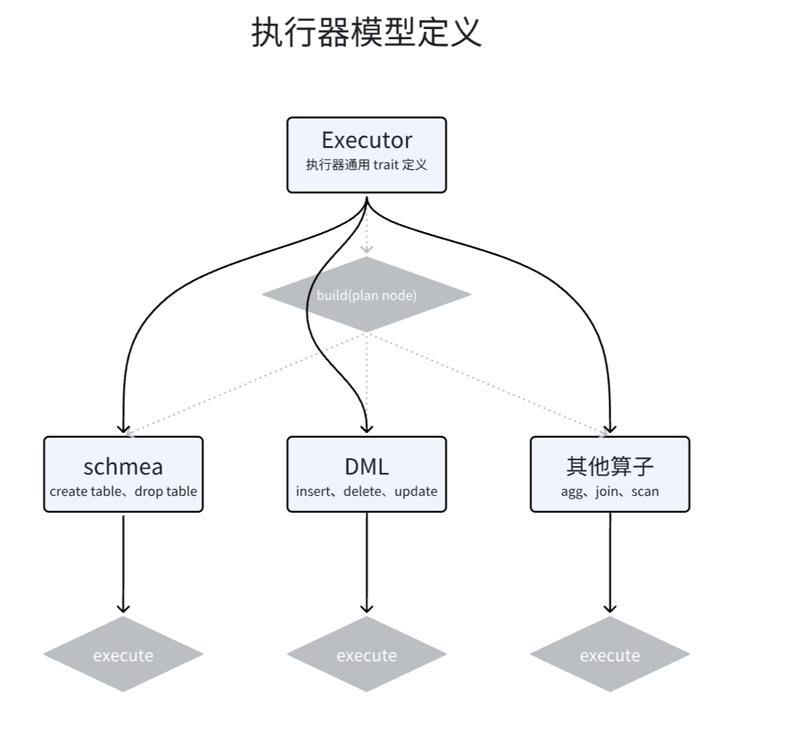

# 执行器的简单定义

从执行计划Planner中，我们拿到了类似如下的执行节点：

```
Plan(CreateTable 
{ schema: Table { 
name: "tbl1", 
columns: [Column { name: "a", datatype: Integer, nullable: true, default: Some(Integer(100)) }, 
Column { name: "b", datatype: Float, nullable: false, default: None }, 
Column { name: "c", datatype: String, nullable: true, default: Some(Null) }, 
Column { name: "d", datatype: Boolean, nullable: true, default: Some(Boolean(true)) }] } })
```

执行器需要做的，就是根据这些执行节点，进行执行，即对数据库中的数据进行排列组合、增删改查等的操作。显然，执行器需要和存储引擎进行交互，所以我们先对执行器进行简单定义，具体逻辑需要等到存储引擎构建完成之后再写。

## 代码实现

1. 新建文件夹sql/executor

以及在sql/mod.rs中：

```rust
pub mod executor;
```

2. 在sql/executor/mod.rs中新建一个接口Executor，它只有一个方法，即执行后返回执行结果集。

```rust
use crate::error::Result;
use crate::sql::types::Row;

pub trait Executor{
    fn execute(&self) -> Result<ResultSet>;
}

// 执行结果集的定义
pub enum ResultSet{
    CreateTable{
        table_name: String,   // 创建表成功，则返回表名
    },
    Insert{
        count: usize,         // 插入表成功，则返回插入数
    },
    Scan{
        columns: Vec<String>,  // 扫描的列
        rows: Vec<Row>,        // 扫描的行
    }
}
```

这里，用到了自定义的新类型Row，实际上就是一组Value，我们在sql/types/mod.rs中这么定义：

```rust
pub type Row = Vec<Value>;
```

3. 分类定义执行器：

executor/schema.rs: DDL部分

```rust
use crate::sql::executor::{Executor, ResultSet};
use crate::sql::schema::Table;

pub struct CreateTable{
    schema: Table,
}

impl CreateTable{
    pub fn new(schema: Table) -> Box<Self> {
        Box::new(Self {schema})
    }
}

impl Executor for CreateTable{
    fn execute(&self) -> crate::error::Result<ResultSet> {
        todo!()  // 具体逻辑等待存储引擎构建完成后再写
    }
}
```

executor/mutation.rs：DML部分

```rust
use crate::sql::executor::{Executor, ResultSet};
use crate::sql::parser::ast::Expression;

pub struct Insert{
    table_name:String,
    columns:Vec<String>,
    values:Vec<Vec<Expression>>,
}

impl Insert{
    pub fn new(table_name:String,columns:Vec<String>,values:Vec<Vec<Expression>>) -> Box<Self> {
        Box::new(Self{table_name,columns,values})
    }
}

impl Executor for Insert{
    fn execute(&self) -> crate::error::Result<ResultSet> {
        todo!()
    }
}
```

executor/query.rs：查询部分

```rust
use crate::sql::executor::{Executor, ResultSet};

pub struct Scan{
    table_name: String,
}

impl Scan{
    pub fn new(table_name: String) -> Box<Self>{
        Box::new(Self{ table_name })
    }
}

impl Executor for Scan{
    fn execute(&self) -> crate::error::Result<ResultSet> {
        todo!()
    }
}
```

4. 将分类的执行器统一化，在mod.rs中：

```rust
use crate::sql::executor::mutation::Insert;
use crate::sql::executor::query::Scan;
use crate::sql::executor::schema::CreateTable;
use crate::sql::planner::Node;

impl dyn Executor{
    pub fn build(node: Node) -> Box<dyn Executor>{
        match node {
            Node::CreateTable {schema} => CreateTable::new(schema),
            Node::Insert {table_name,columns,values} => Insert::new(table_name, columns, values),
            Node::Scan {table_name} => Scan::new(table_name),
        }
    }
}
```

**解释：为什么需要`Box<>`的包裹**：
- `node`的类型在运行时才能确定，接口需要动态分发，因此用`dyn Executor`。
- 各个执行器node的大小不同，需要在堆上分配空间，所以使用`Box`来动态存储 `dyn Executor`。
- 这两者结合，达到了**运行时多态**的效果。与接口泛型不同的是，后者是静态的，dyn trait是动态的。


5. 总结

