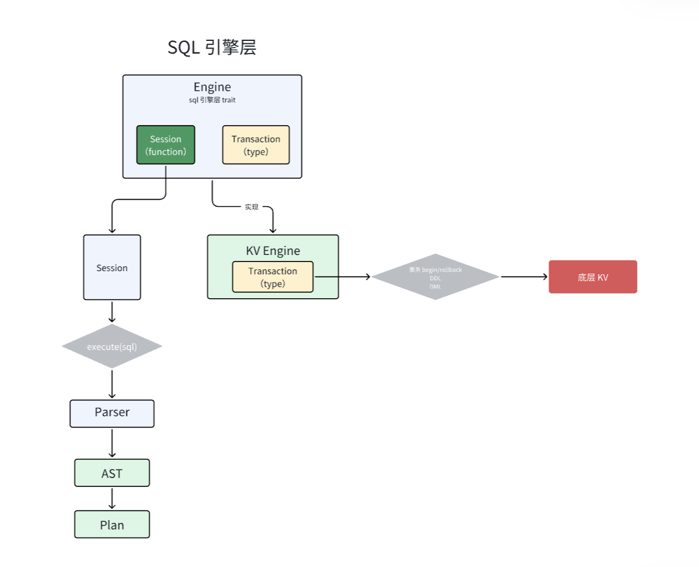
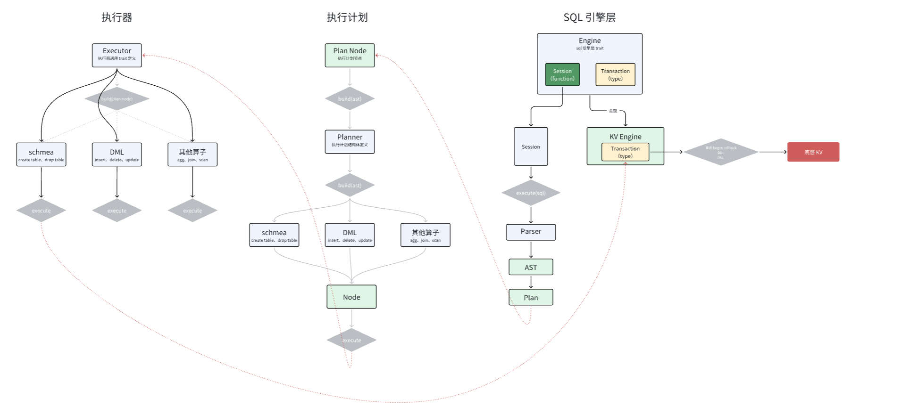

# SQL引擎定义

SQL引擎不同于[之前说的](./01-BasicStructure.md)常见数据库组件，而是作为了一个中间层，串联起了执行器以及底层存储引擎。

这里，我们的存储引擎实现最简单的KV存储引擎。

## 代码实现

1. 新建sql/engine/mod.rs，存放sql引擎的相关代码

```rust
use crate::error::Result;
use crate::sql::executor::ResultSet;
use crate::sql::parser::Parser;
use crate::sql::planner::Plan;
use crate::sql::schema::Table;
use crate::sql::types::Row;

// 定义sql引擎的抽象接口
pub trait Engine: Clone{               // 实现engine的结构体必须可以被clone
    type Transaction: Transaction;     // 实现engine的结构体也必须实现自定义接口Transaction

    fn begin(&self) -> Result<Self::Transaction>;   // 每个sql语句，我们都会将其封装在一个事务中运行，所以执行sql时需要先开启事务

    fn session(&self) -> Result<Session<Self>>{    // 客户端与sql服务端的连接靠session来维持
        Ok(Session{
            engine: self.clone()     // 确保 Session 拥有当前引擎的一个副本
        })
    }
}

// 定义事务的抽象接口，可以接入底层的存储引擎
pub trait Transaction {
    fn commit(&self) -> Result<()>;

    fn rollback(&self) -> Result<()>;

    // 创建行
    fn create_row(&mut self,table:String,row: Row)-> Result<()>;

    // 扫描表
    fn scan(&self,table_name: String)-> Result<Vec<Row>>;

    // DDL
    fn create_table(&mut self, table:Table)-> Result<()>;

    // 获取表的信息
    fn get_table(&self, table_name:String)-> Result<Option<Table>>;
}

pub struct Session<E:Engine>{
    engine:E  // 存储当前的 SQL 引擎实例
}

impl<E:Engine> Session<E>{
    // 执行客户端传来的sql语句
    pub fn execute(&mut self, sql: &str) -> Result<ResultSet>{
        match Parser::new(sql).parse()?{    // 传进来的sql直接扔给parser解析
            sentence => {         //  获取到了一句sql
                  let mut transaction = self.engine.begin()?;  // 开启事务

                  // 开始构建plan
                  match Plan::build(sentence).    // 这里获得一个node
                      execute(&mut transaction){
                      Ok(res) => {
                          transaction.commit()?;  // 成功，事务提交
                          Ok(res)
                      },
                      Err(e) => {
                          transaction.rollback()?;  // 失败，事务回滚
                          Err(e)
                      }
                  }
            }
        }
    }
}
```

这里，我们新增了planner/mod.rs中，planner与底层executor的交互方法：

```rust
// planner与executor交互，plan节点 -> 执行器结构体
    pub fn execute<T:Transaction>(self, transaction :&mut T) -> Result<ResultSet>{
        <dyn Executor<T>>::build(self.0).execute(transaction)  // self.0 == node 只有这一个元素
    }
```

然后要修改executor文件夹下的所有execute()方法参数：

```rust
pub trait Executor<T:Transaction>{
    fn execute(&self,transaction:&mut T) -> Result<ResultSet>;
}

impl<T:Transaction> dyn Executor<T>{
    pub fn build(node: Node) -> Box<dyn Executor<T>>{
        match node {
            Node::CreateTable {schema} => CreateTable::new(schema),
            Node::Insert {table_name,columns,values} => Insert::new(table_name, columns, values),
            Node::Scan {table_name} => Scan::new(table_name),
        }
    }
}
```

```rust
impl<T:Transaction> Executor<T> for Insert{
    fn execute(&self,transaction:&mut T) -> crate::error::Result<ResultSet> {
        todo!()
    }
}
```

```rust
impl<T:Transaction> Executor<T> for Scan{
    fn execute(&self,trasaction:&mut T) -> crate::error::Result<ResultSet> {
        todo!()
    }
}
```

```rust
impl<T:Transaction> Executor<T> for CreateTable{
    fn execute(&self,transaction:&mut T) -> crate::error::Result<ResultSet> {
        todo!()  // 具体逻辑等待存储引擎构建完成后再写
    }
}
```

2. SQLEngine实现的接口可以对接不同的底层存储模型，这里我们以KV为例：

新建engine/kv.rs

```rust
use crate::error::Result;
use crate::sql::engine::{Engine, Transaction};
use crate::sql::schema::Table;
use crate::sql::types::Row;
use crate::storage;

// KV engine 定义
pub struct KVEngine {
    pub kv : storage::Mvcc
}

impl Clone for KVEngine {
    fn clone(&self) -> Self {
        Self{kv: self.kv.clone()}
    }
}

impl Engine for KVEngine {
    type Transaction = KVTransaction;

    fn begin(&self) -> Result<Self::Transaction> {
        Ok(
            Self::Transaction::new(self.kv.begin()?)
        )
    }
}

// 封装存储引擎中的MvccTransaction
pub struct KVTransaction{
    transaction : storage::MvccTransaction
}

impl KVTransaction{
    pub fn new(transaction: storage::MvccTransaction) -> Self {
        Self{transaction}
    }
}

impl Transaction for KVTransaction {
    fn commit(&self) -> Result<()> {
        todo!()
    }

    fn rollback(&self) -> Result<()> {
        todo!()
    }

    fn create_row(&mut self, table: String, row: Row) -> Result<()> {
        todo!()
    }

    fn scan(&self, table_name: String) -> Result<Vec<Row>> {
        todo!()
    }

    fn create_table(&mut self, table: Table) -> Result<()> {
        todo!()
    }

    fn get_table(&self, table_name: String) -> Result<Option<Table>> {
        todo!()
    }
}
```

而KV的底层又是Storage部分，底层存储引擎封装了MVCC，我们需要新建src/storage（和sql是平级的）来先进行抽象定义：

新建mod.rs，记得顺便添加到lib.rs里:

```rust
use crate::error::Result;
pub struct Mvcc{
    // 多版本并发控制，Multi-Version Concurrency Control
}

impl Clone for Mvcc {  // 顶层支持多个所有者，所以需要实现clone方法
    fn clone(&self) -> Mvcc {
        Self{}
    }
}

impl Mvcc {
    pub fn new() -> Self { Self{} }

    pub fn begin(&self) -> Result<MvccTransaction>{   // 开启事务
        Ok(MvccTransaction::new())
    }
}

pub struct MvccTransaction{
    // 代表一个具体的事务
}  
impl MvccTransaction {
    pub fn new() -> Self { Self{} }
}
```

## 流程总结
执行流程总结如下：

1. **客户端发送SQL语句：**
    - 客户端通过`Session`向SQL引擎发送SQL语句字符串。

2. **Session接收并处理SQL语句：**
    - `Session`的`execute`方法接收SQL字符串 `sql`。
    - `sql`被传递给`Parser`解析。

3. **解析SQL语句：**
    - `Parser::new(sql).parse()`解析SQL字符串，得到`sentence`（表示解析后的SQL语句结构）。

4. **开始事务：**
    - 调用`self.engine.begin()`开启一个新的事务，得到`transaction`。

5. **构建执行计划Plan：**
    - 使用`Plan::build(sentence)`基于解析的语句构建执行计划（Plan）。
    - 生成的`Plan`包含执行所需的节点信息。

6. **执行计划：**
    - 调用`Plan`的`execute`方法，传入`transaction`。
      ```rust
      Plan::build(sentence).execute(&mut transaction)
      ```
    - 在`execute`方法中，将`Plan`节点转换为对应的`Executor`：
      ```rust
      <dyn Executor<T>>::build(self.0).execute(transaction)
      ```
        - 其中，`self.0`是`Plan`中的节点信息。

7. **构建执行器Executor：**
    - 根据`Plan`节点的类型，构建相应的`Executor`实例（如`CreateTable`、`Insert`、`Scan`）：
      ```rust
      match node {
          Node::CreateTable { schema } => CreateTable::new(schema),
          Node::Insert { table_name, columns, values } => Insert::new(table_name, columns, values),
          Node::Scan { table_name } => Scan::new(table_name),
      }
      ```

8. **执行具体操作：**
    - 调用对应`Executor`的`execute`方法，传入`transaction`。
      ```rust
      executor.execute(&mut transaction)
      ```
    - `Executor`在执行过程中，通过`Transaction`接口与底层存储交互，进行实际的数据操作（如创建表、插入数据、扫描表等）。

9. **事务提交或回滚：**
    - **执行成功：**
        - 如果`Executor`执行成功，调用`transaction.commit()`提交事务。
    - **执行失败：**
        - 如果执行过程中发生错误，捕获异常，调用`transaction.rollback()`回滚事务。

10. **返回结果：**
    - 将执行结果`ResultSet`返回给`Session`，然后返回给客户端。

11. **底层存储交互：**
    - `KVEngine`实现了`Engine`接口，使用`storage::Mvcc`作为底层存储。
    - `KVTransaction`实现了`Transaction`接口，封装了`storage::MvccTransaction`，用于实际的数据读写和事务管理。

**整体流程简述：**

客户端发送SQL语句 -> `Session`接收并调用`execute`方法 -> 使用`Parser`解析SQL -> 开启事务`transaction` -> 使用`Plan`构建执行计划 -> `Plan`调用`execute`并构建`Executor` -> `Executor`执行具体操作并与`Transaction`交互 -> 成功则`transaction.commit()`，失败则`transaction.rollback()` -> 返回`ResultSet`给客户端。


可以查看示例图：



以及全流程的总结：

