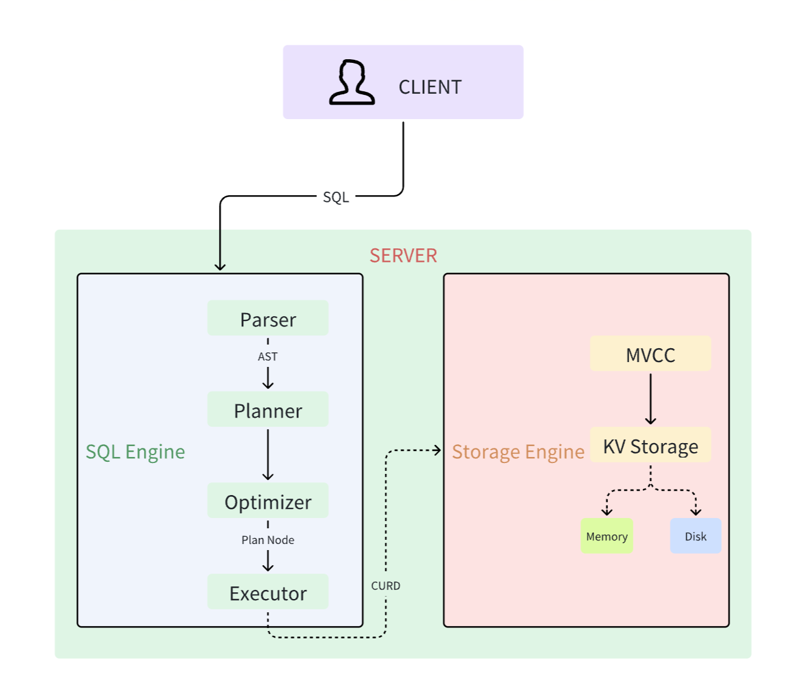
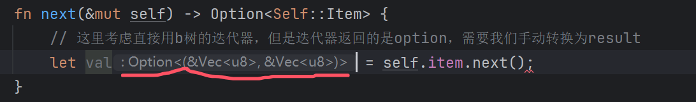

# 内存存储引擎



存储层，向下负责数据的存储和控制，向上提供简单的增删改查接口。

我们先简单实现内存的存储引擎，以便于我们先快速运行期sql，之后再专门实现基于磁盘的存储引擎。

内存的存储引擎，我们使用Rust自带的BTreeMap，即[B-树](https://www.bilibili.com/video/BV1mY4y1W7pS)（有序的多路查询树）来实现。
- [B-树可视化](https://www.cs.usfca.edu/~galles/visualization/BTree.html)

### 简要示例
#### B树

```
      [10, 20]
     /    |    \
  [5, 8] [15]  [25, 30]
```

- 10和20是根节点的键，分别划分了三段子树。
- 每个子节点内存储了数据。

#### B+树

```
       [10, 20]
      /    |    \
    [5, 8] [15] [25, 30]

叶子层:
[5] -> [8] -> [15] -> [25] -> [30]
```

- 根节点用于索引划分范围。
- 叶子层包含了所有数据节点，并且通过指针连接在一起形成链表。

### B树和B+树的区别

| 特性            | B树                          | B+树                           |
| --------------- | ---------------------------- | ------------------------------ |
| **数据存储位置**| 内部节点和叶节点             | 仅叶节点                        |
| **查找效率**    | 较慢，可能需要遍历到叶节点    | 较快，数据只在叶节点            |
| **范围查询**    | 较复杂                       | 简单，叶节点链表可直接遍历       |
| **空间利用率**  | 较高                         | 较低                           |
| **适用场景**    | 适用于高读写频率的数据结构   | 适用于文件系统、数据库索引等    |

## 代码实现

1. 新建storage/engine.rs，注意这个和之前sql层的engine需要做出区分，这个存储引擎对接的不是用户，而是内存/磁盘。

```rust
use std::ops::RangeBounds;
use crate::error::Result;

pub trait Engine{   // 抽象存储引擎接口定义，对接内存/磁盘
    type EngineIter: EngineIter;   // 需要实现一个存储引擎迭代器

    // 增
    fn set(&mut self, key: Vec<u8>, value: Vec<u8>) -> Result<()>;

    // 查
    fn get(&mut self, key: Vec<u8>) -> Result<Option<Vec<u8>>>;

    // 删
    fn delete(&mut self, key: Vec<u8>) -> Result<()>;

    // 扫描
    fn scan(&mut self,range: impl RangeBounds<Vec<u8>>) -> Self::EngineIter;
    // RangeBounds用法：
    // .. 无界范围
    // a..b [a,b)
    // a..=b：[a,b]
    // ..b： (,b)
    // a..   [a,]

    // 前缀扫描
    fn prefix_scan(&mut self, prefix: Vec<u8>) -> Self::EngineIter{
        todo!()
    }
}

pub trait EngineIter: DoubleEndedIterator<Item=Result<(Vec<u8>,Vec<u8>)>>{}
// 继承了 DoubleEndedIterator，并且指定了迭代器的 Item 类型为 Result<(Vec<u8>, Vec<u8>)>
// DoubleEnded支持双向扫描
```

2. 对自定义的接口进行实现，这里实现内存存储引擎，即memory.rs

```rust
use std::collections::{btree_map, BTreeMap};
use std::ops::RangeBounds;
use crate::error::Result;
use crate::storage::engine::{Engine, EngineIter};

// 内存存储引擎，即 ./engine.rs 的具体实现，使用BTreeMap
pub struct MemoryEngine{
    data: BTreeMap<Vec<u8>, Vec<u8>>,
}

impl MemoryEngine{
    pub fn new() -> Self{
        Self{
            data: BTreeMap::new(),
        }
    }
}

impl Engine for MemoryEngine{
    type EngineIter<'a> = MemoryEngineIter<'a>;

    fn set(&mut self, key: Vec<u8>, value: Vec<u8>) -> Result<()> {
        todo!()
    }

    fn get(&mut self, key: Vec<u8>) -> Result<Option<Vec<u8>>> {
        todo!()
    }

    fn delete(&mut self, key: Vec<u8>) -> Result<()> {
        todo!()
    }

    fn scan(&mut self, range: impl RangeBounds<Vec<u8>>) -> Self::EngineIter {
        todo!()
    }
}

// 内存存储引擎迭代器，可以直接使用B-Tree的内置方法
pub struct MemoryEngineIter<'a>{
    item: btree_map::Range<'a, Vec<u8>, Vec<u8>>,  // 引用了B树的键值对，至少是两个引用，所以需要生命周期
}

impl<'a> EngineIter for MemoryEngineIter<'a>{
    // 因为继承自DoubleEndedIterator接口，所以根据编译器提示需要实现next, next_back
}

impl<'a> MemoryEngineIter<'a>{
    // 手动将option转换为result
    fn map(item:(&Vec<u8>,&Vec<u8>)) -> <Self as Iterator>::Item {  // 这里的Item指的是 type Item = Result<(Vec<u8>, Vec<u8>)>;
        let (k,v) = item;
        Ok((k.clone(), v.clone()))
    }
}

// 支持向前遍历
impl<'a> Iterator for MemoryEngineIter<'a> {
    type Item = Result<(Vec<u8>, Vec<u8>)>;  // 为了兼容后续磁盘，磁盘可能报err，所以这里迭代器用Result包裹

    fn next(&mut self) -> Option<Self::Item> {
        // 这里考虑直接用b树的迭代器，但是迭代器返回的是option，需要我们手动转换为result
        self.item.next().map(|tuple| Self::map(tuple))
    }
}

// 支持双向遍历
impl<'a> DoubleEndedIterator for MemoryEngineIter<'a> {
    fn next_back(&mut self) -> Option<Self::Item> {  // 向前遍历
        self.item.next_back().map(|tuple| Self::map(tuple))
    }
}
```

小提示，这里不清楚传递的是什么类型的时候，可以先打个草稿，直接让ide自动补全告诉你是什么类型：



3. 根据编译器提示，修改engine.rs部分代码的生命周期：

```rust
type EngineIter<'a>: EngineIter where Self: 'a;  //EngineIter 的生命周期不能超过它所在的 Engine 的生命周期

fn scan(&mut self,range: impl RangeBounds<Vec<u8>>) -> Self::EngineIter<'_>;  // 自动推断生命周期

fn prefix_scan(&mut self, prefix: Vec<u8>) -> Self::EngineIter<'_>{
    todo!()
}
```

4. 继续完善memory.rs，也即调B-树的api:

```rust
impl Engine for MemoryEngine{
    type EngineIter<'a> = MemoryEngineIter<'a>;

    fn set(&mut self, key: Vec<u8>, value: Vec<u8>) -> Result<()> {
        self.data.insert(key, value);
        Ok(())
    }

    fn get(&mut self, key: Vec<u8>) -> Result<Option<Vec<u8>>> {
        let val = self.data.get(&key).cloned();
        Ok(val)
    }

    fn delete(&mut self, key: Vec<u8>) -> Result<()> {
        self.data.remove(&key);
        Ok(())
    }

    fn scan(&mut self, range: impl RangeBounds<Vec<u8>>) -> Self::EngineIter<'_> {
        MemoryEngineIter{
            item: self.data.range(range),
        }
    }
}
```

5. 完善前缀扫描：

```rust
// 前缀扫描
    fn prefix_scan(&mut self, prefix: Vec<u8>) -> Self::EngineIter<'_>{
        // 特定条件下的scan
        let start = Bound::Included(prefix.clone());
        let mut bound_prefix = prefix.clone();
        if let Some(last) = bound_prefix.iter_mut().last() {  // iter_mut().last()获取bound_prefix的最后一个字节的可变引用
            *last += 1;
        }
        let end = Bound::Excluded(bound_prefix);
        self.scan((start,end))
    }
```

**前缀扫描的例子**

```
aaaa
aaab
aaac
aabb
aabc
ab
ac
b
```

**示例操作**

我们想扫描所有以前缀`"aa"`开头的键。

1) **输入前缀**：`prefix = vec![97, 97]`（即ASCII的`"aa"`）

2) **设置起始边界**：
    - `start = Bound::Included(prefix.clone())`
    - 即`start = Bound::Included(vec![97, 97])`，表示起始键从`"aa"`开始，包含`"aa"`本身。

3) **计算结束边界**：
    - 克隆前缀：`bound_prefix = prefix.clone()`，得到`bound_prefix = vec![97, 97]`。
    - 将最后一个字节加一：`bound_prefix[1] += 1`，即`bound_prefix`变为`vec![97, 98]`。
    - 这样，`bound_prefix`表示`"ab"`。

4) **设置结束边界**：
    - `end = Bound::Excluded(bound_prefix)`，即`end = Bound::Excluded(vec![97, 98])`
    - 表示扫描范围到`"ab"`之前（不包含`"ab"`本身）。

5) **扫描范围**：
    - **起始边界**：`start = Bound::Included(vec![97, 97])`，即从`"aa"`开始，包含`"aa"`。
    - **结束边界**：`end = Bound::Excluded(vec![97, 98])`，即到`"ab"`之前（不包含`"ab"`）。

因此，扫描范围是所有以`"aa"`开头的键，最终得到以下结果：

```
aaaa
aaab
aaac
aabb
aabc
```


6. 在engine.rs中进行一些测试：

```rust
#[cfg(test)]
mod tests {
    use super::Engine;
    use crate::{error::Result, storage::memory::MemoryEngine};
    use std::ops::Bound;

    // 测试点读的情况
    fn test_point_opt(mut eng: impl Engine) -> Result<()> {
        // 测试获取一个不存在的 key
        assert_eq!(eng.get(b"not exist".to_vec())?, None);

        // 获取一个存在的 key
        eng.set(b"aa".to_vec(), vec![1, 2, 3, 4])?;
        assert_eq!(eng.get(b"aa".to_vec())?, Some(vec![1, 2, 3, 4]));

        // 重复 put，将会覆盖前一个值
        eng.set(b"aa".to_vec(), vec![5, 6, 7, 8])?;
        assert_eq!(eng.get(b"aa".to_vec())?, Some(vec![5, 6, 7, 8]));

        // 删除之后再读取
        eng.delete(b"aa".to_vec())?;
        assert_eq!(eng.get(b"aa".to_vec())?, None);

        // key、value 为空的情况
        assert_eq!(eng.get(b"".to_vec())?, None);
        eng.set(b"".to_vec(), vec![])?;
        assert_eq!(eng.get(b"".to_vec())?, Some(vec![]));

        eng.set(b"cc".to_vec(), vec![5, 6, 7, 8])?;
        assert_eq!(eng.get(b"cc".to_vec())?, Some(vec![5, 6, 7, 8]));
        Ok(())
    }

    // 测试扫描
    fn test_scan(mut eng: impl Engine) -> Result<()> {
        eng.set(b"nnaes".to_vec(), b"value1".to_vec())?;
        eng.set(b"amhue".to_vec(), b"value2".to_vec())?;
        eng.set(b"meeae".to_vec(), b"value3".to_vec())?;
        eng.set(b"uujeh".to_vec(), b"value4".to_vec())?;
        eng.set(b"anehe".to_vec(), b"value5".to_vec())?;

        let start = Bound::Included(b"a".to_vec());
        let end = Bound::Excluded(b"e".to_vec());

        let mut iter = eng.scan((start.clone(), end.clone()));
        let (key1, _) = iter.next().expect("no value founded")?;
        assert_eq!(key1, b"amhue".to_vec());

        let (key2, _) = iter.next().expect("no value founded")?;
        assert_eq!(key2, b"anehe".to_vec());
        drop(iter);

        let start = Bound::Included(b"b".to_vec());
        let end = Bound::Excluded(b"z".to_vec());
        let mut iter2 = eng.scan((start, end));

        let (key3, _) = iter2.next_back().expect("no value founded")?;
        assert_eq!(key3, b"uujeh".to_vec());

        let (key4, _) = iter2.next_back().expect("no value founded")?;
        assert_eq!(key4, b"nnaes".to_vec());

        let (key5, _) = iter2.next_back().expect("no value founded")?;
        assert_eq!(key5, b"meeae".to_vec());

        Ok(())
    }

    // 测试前缀扫描
    fn test_scan_prefix(mut eng: impl Engine) -> Result<()> {
        eng.set(b"ccnaes".to_vec(), b"value1".to_vec())?;
        eng.set(b"camhue".to_vec(), b"value2".to_vec())?;
        eng.set(b"deeae".to_vec(), b"value3".to_vec())?;
        eng.set(b"eeujeh".to_vec(), b"value4".to_vec())?;
        eng.set(b"canehe".to_vec(), b"value5".to_vec())?;
        eng.set(b"aanehe".to_vec(), b"value6".to_vec())?;

        let prefix = b"ca".to_vec();
        let mut iter = eng.prefix_scan(prefix);
        let (key1, _) = iter.next().transpose()?.unwrap();
        assert_eq!(key1, b"camhue".to_vec());
        let (key2, _) = iter.next().transpose()?.unwrap();
        assert_eq!(key2, b"canehe".to_vec());

        Ok(())
    }

    #[test]
    fn test_memory() -> Result<()> {
        test_point_opt(MemoryEngine::new())?;
        test_scan(MemoryEngine::new())?;
        test_scan_prefix(MemoryEngine::new())?;
        Ok(())
    }
}
```