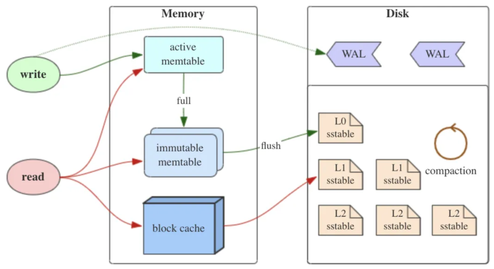
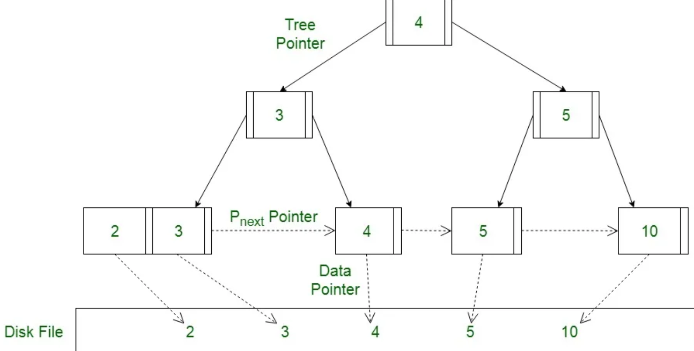
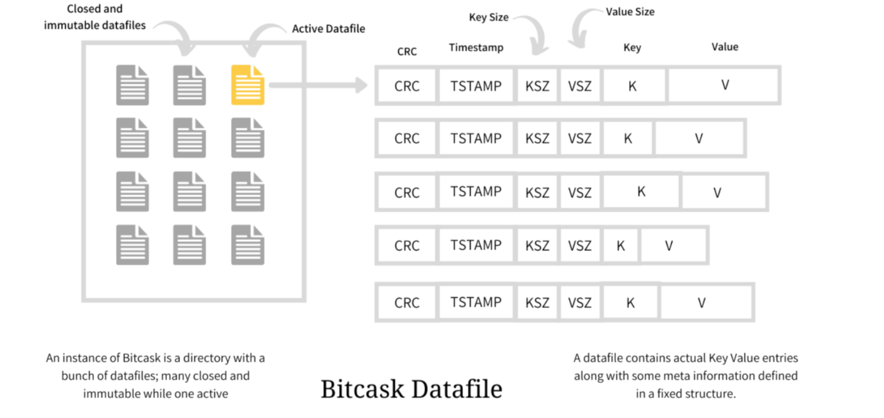
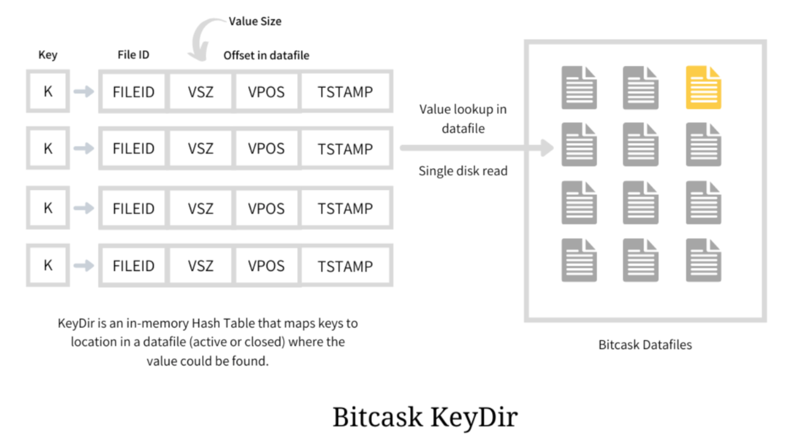

# KV磁盘存储模型

之前我们仅实现了[内存存储](../01-BasicStructure/07-MemStorage.md)，这样数据是无法持久化的，现在我们加入磁盘存储。

接下来介绍几种常见的提供KV接口的磁盘存储模型。之所以叫KV磁盘存储模型，是因为在LSM Tree、B+树和Bitcask这些模型中，数据都是以键值对的形式存储。

## LSM Tree - Log Structure Merge 日志结构合并树

这是一种写优化模型。如下图，LSM Tree 模型是一种写优化的存储模型，在内存中维护着多个`memory table`，但同时仅有一个是活跃的。一般而言会使用跳表或者红黑树来维护`memTable`。

当一个`memTable`被写满后，会变为不可变的`memTable`。后台会有线程定期将写满的`memTable`写入外存（flush），由于跳表或红黑树是有序的，所以内存里的数据是有序的，所以外存中数据也是有序的，数据存储在`SSTable`（不变的排序文件）中。

`SSTable`数据是分层的，即可能最新的数据在最上层，比如对一个key可能操作多次，我们只要合并成一次即可，所以`SSTable`中是存在重复数据、或者过期数据的。定期对`SSTable`的合并操作叫`compaction(压实)`。

读取时，参考408的课程，都是由热到冷的过程，即：`active memTable` -> `immutable memTable` -> `SSTable`，其中，内存的读取可以用`block cache`加速。

如果内存崩溃时，正在向`active memTable`书写的数据可能会丢失，这里LSM采用了预写日志`WAL`的方法保证数据持久性。

**优点：**
1. **写性能高**：写操作先写入内存，并且只需追加到磁盘文件末尾（append-only），减少了磁盘写的次数。
2. **适合高并发写入**：由于写操作主要在内存中进行，LSM 树非常适合写密集型的工作负载。
3. **空间利用率高**：通过合并操作可以减少磁盘碎片，提高存储空间利用率。

**缺点：**
1. **读性能可能受影响**：由于数据分布在多个 SSTable 中，读操作可能需要查找多个文件，增加了延迟。
2. **合并操作成本高**：合并操作需要大量的 I/O 资源，在高负载下可能影响系统性能。

**常见的基于 LSM 树实现的存储引擎**：包括 LevelDB 和 RocksDB（目前较广泛）。

## B+树

**原理**
B+ 树是一种平衡树结构，广泛应用于关系型数据库和文件系统中。它由多个节点组成，每个节点包含多个键和指向子节点的指针。B+ 树的叶子节点包含所有数据（根节点不存数据只存指针），并通过双向链表连接。B+ 树通过保持树的平衡，确保所有叶子节点的深度相同，从而提供了高效的插入、删除和查找操作。

**优点**
1. **读性能高**：由于 B+ 树是高度平衡的，查找操作可以在对数时间（logN）内完成，非常高效。
2. **范围查询高效**：叶子节点通过链表连接，支持快速的范围查询。
3. **稳定的读写性能**：B+ 树能够在大多数情况下保持稳定的读写性能。

**缺点**
1. **写性能相对较低**：插入和删除操作可能导致树的重新平衡（Rebalance），需要较多的随机 I/O 操作，影响写性能。
2. **空间利用率相对较低**：节点分裂和合并操作会导致一定的空间浪费。

常见的基于 B+ 树实现的存储引擎：包括 LMDB 和 BoltDB，MySQL-InnoDB等。

## Bitcask

Bitcask是最简单的KV存储模型，采用日志结构存储，所有的写操作会追加到日志文件的末尾。如下图，每个文件实际上是无序的，现在新写了第一行数据。

新增完成后，Bitcask会在内存中新增索引结构：`{key,{file_id, file_location,...}}`。每次查询时，根据key找到文件的详细属性，再根据属性向外存中寻找数据。

Bitcask会定期进行合并和压缩，移除无用的数据和重复的键。

**优点**
1. **写性能极高**：写操作只需追加到日志文件末尾，不涉及复杂的数据结构调整。
2. **读性能高**：通过内存中的索引可以快速定位数据位置，减少磁盘 I/O。
3. **简单易实现**：实现相对简单，适合嵌入式系统和轻量级应用。

**缺点**
1. **内存消耗大**：所有键及其对应的位置都存储在内存中，对于大规模数据集，内存消耗较高。
2. **不适合频繁更新**：频繁更新同一键的数据会导致日志文件膨胀，需要频繁进行合并操作。

常见的基于 Bitcask 实现的存储引擎包括 RoseDB。

**我们使用最简单的Bitcask模型作为sql数据库的存储引擎**。