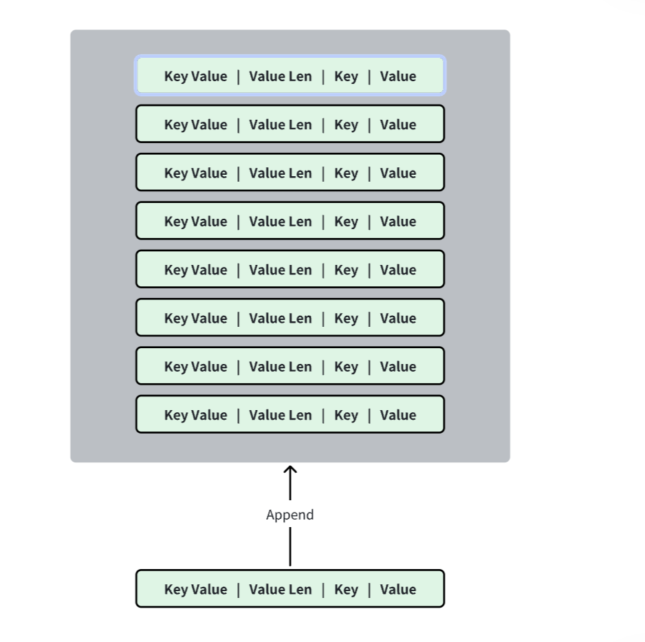
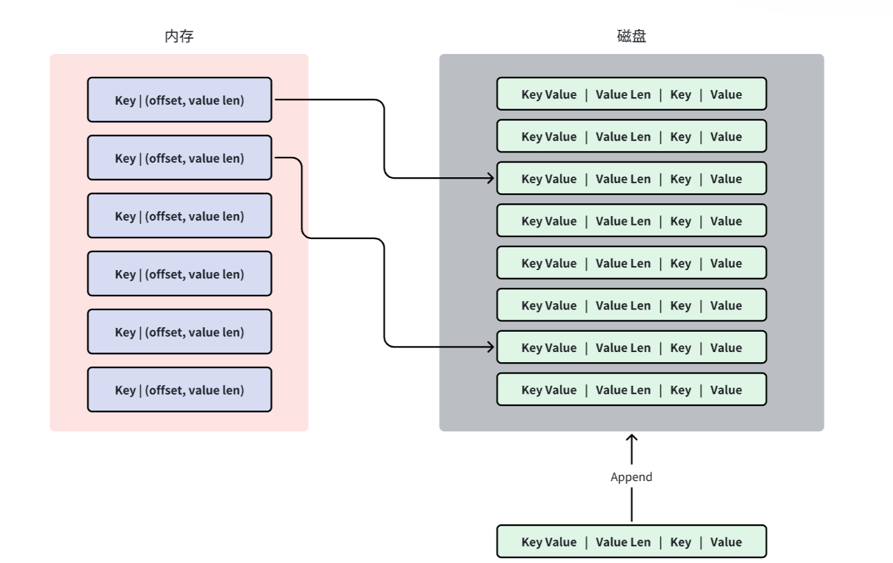

# 存储引擎基础方法——实现基础Bitcask存储模型

实现Bitcask存储模型包括两个部分，1）磁盘上的数据文件 2）内存中的KeyDir

**磁盘中**：



我们为了简单，先使用一个磁盘文件来保存数据，它的日志追加方式是`append-only`的，每条数据可以看做是一条写到文件末尾的日志数据，已经写入的数据永远不会被修改。

如图所示，我们存储的格式为：

```
+----------------+----------------+-------------------+-------------------+
| key len(4)     | val len(4)     | key(varint)       | val(varint)       |
+----------------+----------------+-------------------+-------------------+
```

前缀的定长8个字节是key和value的长度，后面是key和value的内容，长度是可变的。

**内存中**：



我们使用Rust的`BTree-Map`来构建内存的索引，它是基于B-树构建的有序map。

内存索引的格式为：

```
key | (offset, value-len)
```

offset指明了**value**在内存中存放的偏移量，value-len指明了value的长度。

## 代码实现

基于上述理论，我们来实现Set、Get和Delete。
- Set
  - 首先向磁盘中追加写入一条日志数据，获取对应的offset和value-len
  - 更新内存索引，即存储`key | (offset, value-len)`
- Get
  - 从内存中获取对应的索引内容，然后根据`(offset, value-len)`从磁盘中找数据
- Delete
  - 可以将`value-len`设置为-1，表示这是个tome-stone墓碑值（详见论文），value部分是没有数据的
  - 当重启的时候，如果我们获取到`value-len==-1`，那么就可以执行删除操作

新建storage/disk.rs，存放磁盘存储引擎的相关定义，这个和之前的内存存储引擎大致是一样的

```rust
use std::collections::BTreeMap;
use std::fs::File;
use std::io::{BufWriter, Read, Seek, SeekFrom, Write};
use std::ops::RangeBounds;
use crate::storage::engine::{Engine, EngineIter};
use crate::error::Result;

// 先定义一下内存的数据结构
pub type KeyDir = BTreeMap<Vec<u8>, (u64,u32)>;  // key | (offset, value-len)

// 再定义一下磁盘数据的前缀
const LOG_HEADER_SIZE: u32 = 8; // size(key_len) + size(value_len) = 8

// 磁盘存储引擎的定义
pub struct DiskEngine{
    key_dir: KeyDir,    // 内存索引
    log: Log,           // 磁盘日志
}

struct Log{
    file: File  // 日志存储文件
}

impl Log{
    // 实现读日志和写日志的方法
    fn write_log(&mut self, key: &Vec<u8>, value:Option<&Vec<u8>>) -> Result<(u64, u32)> {
        // 传引用是为了避免数据拷贝，这个函数直接返回 (offset, size) 即可

        // 1. 追加写入，首先要找到文件的末尾，即从End开始的第0个字节
        let start = self.file.seek(SeekFrom::End(0))?;  // 从start处开始写文件

        // 2. 使用BufferWriter进行写操作
        let key_len = key.len() as u32;
        let value_len = value.map_or(0, |v| v.len() as u32);  // value可能为空，需要操作一下
        let total_len = LOG_HEADER_SIZE + key_len + value_len;
        let mut writer =                                    // 得到了一个写缓冲器
            BufWriter::with_capacity(total_len as usize, &self.file);  // (缓冲区大小，文件)
        writer.write_all(&key_len.to_be_bytes())?;                    // write_all 保证必须将内容全部写入，否则会报错
        writer.write_all(&value.map_or(-1, |v| v.len() as i32).to_be_bytes())?;  // value为None则value_size = -1
        writer.write_all(&key)?;
        if let Some(v) = value{
            writer.write_all(&v)?;
        }
        writer.flush()?;  // 将缓冲区的文件刷新为持久化
        Ok((start, total_len))
    }

    fn read_log(&mut self, offset: u64, value_len: u32) -> Result<Vec<u8>>{
        // 读取value的数据
        self.file.seek(SeekFrom::Start(offset))?;
        let mut buffer= vec![0; value_len as usize];   // 大小为 value_len，其中每个元素初始化为 0
        self.file.read_exact(&mut buffer)?;     // 和write_all() 一样，read_exact()保证必须将内容全部读完，否则会报错
        Ok(buffer)  // buffer是大小为value长度的01字符流
    }
}

// 实现一下通用的engine接口：
impl Engine for DiskEngine {
    type EngineIter<'a>= DiskEngineIter;

    fn set(&mut self, key: Vec<u8>, value: Vec<u8>) -> Result<()> {
        // 1. 先写日志
        let (offset, size) = self.log.write_log(&key, Some(&value))?;
        // 2. 再更新内存索引
        let value_len = value.len() as u32;
        self.key_dir.insert(key, (
            offset + size as u64 - value_len as u64, value_len
            ));
        Ok(())
    }

    fn get(&mut self, key: Vec<u8>) -> Result<Option<Vec<u8>>> {
        match self.key_dir.get(&key) {
            Some((offset, size)) => {
                let value = self.log.read_log(*offset, *size)?;
                Ok(Some(value))
            },
            None => Ok(None)
        }
    }

    fn delete(&mut self, key: Vec<u8>) -> Result<()> {
        self.log.write_log(&key, None)?;  // 直接删除value即可
        self.key_dir.remove(&key);
        Ok(())
    }

    fn scan(&mut self, range: impl RangeBounds<Vec<u8>>) -> Self::EngineIter<'_> {
        todo!()
    }
}


// 磁盘存储引擎的迭代器我们先简单定义，后续再实现：
pub struct DiskEngineIter{}

impl EngineIter for DiskEngineIter {}

impl Iterator for DiskEngineIter {
    type Item = Result<(Vec<u8>, Vec<u8>)>;

    fn next(&mut self) -> Option<Self::Item> {
        todo!()
    }
}

impl DoubleEndedIterator for DiskEngineIter {
    fn next_back(&mut self) -> Option<Self::Item> {
        todo!()
    }
}
```

注意，write_log()返回的是offset和size，这是针对于整条数据而言的，具体来说：

```
若现在有：offset=100, size=50, value-len=20，则：

地址 100----------------130--------150
                            value
显然 size - value_len = 130，这就是value的偏移，即找到具体位置后，需要读130才能读到value   
==> offset = write_log().offset + write_log().size - value_len = 130                     
```

这里我们还用到了文件的错误处理，在error.rs中新增：

```rust
// 文件相关错误
impl From<std::io::Error> for Error{
    fn from(value: std::io::Error) -> Self {
        Error::Internal(value.to_string())
    }
}
```