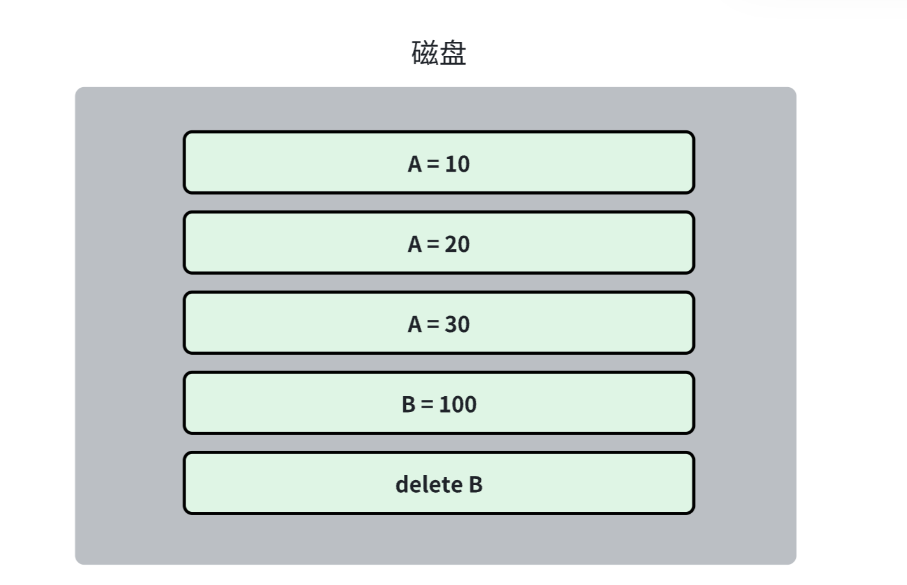
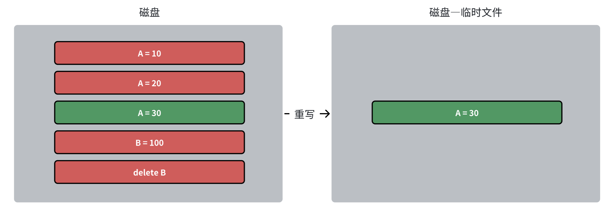

# 存储引擎的启动和清理

前面实现了存储引擎的基本方法：get,set,delete

现在来实现存储引擎的启动和回收、清理等操作。

**启动流程**：

启动前，内存里是没有KeyDir索引的，所以面对无序的磁盘数据，我们需要手动构建内存索引：即遍历这个数据库中所有的日志，取出所有的`key | (offset, value)`，将其存储在内存索引结构当中。

**回收和清理流程**：



根据我们之前所说，写入数据库文件的日志，是永远不会被修改的，那么如上图更新日志，就会出现冗余的情况。而Bitcask论文提出了如下图的解决方法，即重写原日志文件到一个临时文件，重写完成后将临时文件变为正式文件，然后删除旧的冗余文件即可。



## 代码实现

1. 启动流程：实际上就是要初始化Log和KeyDir，继续之前的disk.rs:

```rust
struct Log{
    file: File,  // 日志存储文件
    file_path: PathBuf,  // 日志存储路径
}

impl Log{
    // 实现启动方法
    fn new(file_path: PathBuf) -> Result<Self>{
        // 如果传入的路径不存在，则需要自动创建
        if let Some(parent) = file_path.parent(){  // abc/sql.log，如果目录abc不存在则需要创建
            if !parent.exists(){
                std::fs::create_dir_all(parent)?;
            }
        }

        // log文件存在或被创建成功，则打开文件
        let file = OpenOptions::new().write(true).read(true).create(true).open(&file_path)?;  // 可写可读可创建

        // 加锁，本文件不能并发地被其他数据库客户端使用
        file.try_lock_exclusive()?;   // 排他锁

        Ok(Self{ file,file_path })
    }

    // 构建内存索引
    fn build_key_dir(&mut self) -> Result<KeyDir> {
        let mut key_dir = KeyDir::new();
        let mut reader = BufReader::new(&self.file);

        let mut offset = 0;  // 从文件开始读
        loop{
            if offset >= self.file.metadata()?.len(){
                break;   // 读完跳出循环
            }

            let (key, val_len) = Self::read_log(&mut reader, offset)?;
            let key_len = key.len() as u32;
            if val_len == -1{
                key_dir.remove(&key);
                offset += LOG_HEADER_SIZE as u64 + key_len as u64;
            }else {
                key_dir.insert(key,(
                    offset + LOG_HEADER_SIZE as u64 + key_len as u64, val_len as u32
                ));
                offset += LOG_HEADER_SIZE as u64 + key_len as u64 + val_len as u64;
            }
        }
        Ok(key_dir)
    }

    // 构建内存索引辅助方法
    fn read_log(reader: &mut BufReader<&File>, offset: u64) -> Result<(Vec<u8>, i32)>{
        reader.seek(SeekFrom::Start(offset))?;

        let mut buffer = [0;4];  // 大小为4的定长临时数组，用于存放读取到的key_len和value_len
        reader.read_exact(&mut buffer)?;
        let key_len = u32::from_be_bytes(buffer);

        reader.read_exact(&mut buffer)?;
        let value_len = i32::from_be_bytes(buffer);   // value_len 可能是 -1，所以是i32

        let mut key_buffer = vec![0; key_len as usize];   // 大小为 key_len 的变长临时数组，用于存放读到的 key
        reader.read_exact(&mut key_buffer)?;

        Ok((key_buffer, value_len))  // 返回key的字符码以及value的长度，这里不返回value是因为我们有单独的read_value函数
    }
}

impl DiskEngine {
// 启动流程
pub fn new(file_path: PathBuf) -> Result<Self>{  // 传入日志文件路径
    // 1. 启动磁盘日志
    let mut log = Log::new(file_path)?;
    // 2. 从log中拿到数据，构建内存索引
    let  key_dir = log.build_key_dir()?;
    Ok(DiskEngine{ key_dir,log })
}
}
```

给文件加锁的代码涉及到了第三方库：

```toml
[dependencies]
fs4 = "0.8.4"
```

为启动流程写个简单测试：

```rust
#[test]
fn test_disk_engine_start() -> Result<()> {
    let eng = DiskEngine::new(PathBuf::from("./tmp/sqldb-log"))?;  // 即主项目路径下的tmp文件夹
    Ok(())
}
```

2. 清理与回收流程，即compact：

```rust
impl DiskEngine {
    // 启动时清理
    pub fn new_compact(file_path: PathBuf) -> Result<Self>{
        // 启动存储引擎
        let mut engine = DiskEngine::new(file_path)?;  // 启动好的存储引擎已经包含了完整的log和key_dir，所以我们只要重写即可
        engine.compact()?;
        Ok(engine)
    }

    // 重写重复文件
    pub fn compact(&mut self) -> Result<()> {
        // 1. 在log相同目录打开一个新的临时文件
        let mut compact_path = self.log.file_path.clone();
        compact_path.set_extension("compact");   // 后缀名
        let mut compact_log = Log::new(compact_path)?;

        // 2. 在临时文件中重写
        let mut compact_key_dir = KeyDir::new();
        for(key, (offset, value_len)) in self.key_dir.iter() {
            let value = self.log.read_value(*offset, *value_len)?;
            let (compact_offset, compact_size) = compact_log.write_log(&key, Some(&value))?;
            compact_key_dir.insert(key.clone(), (
                compact_offset + compact_size as u64 - *value_len as u64, *value_len as u32
            ));
        }

        // 3. 将临时文件变为正式文件，删除原正式文件
        rename(&compact_log.file_path, &self.log.file_path)?;  // compact_log.file_path 变成 self.log.file_path，临时日志文件被“升级”为正式文件，原来的正式文件会被覆盖或删除。
        compact_log.file_path = self.log.file_path.clone();   // 确保 compact_log.file_path 和 self.log.file_path 保持一致
        self.key_dir = compact_key_dir;
        self.log = compact_log;    // 使 self.log 指向最新的日志文件

        Ok(())
    }
}
```

测试：

```rust
#[test]
fn test_disk_engine_compact() -> Result<()> {
    let eng = DiskEngine::new_compact(PathBuf::from("./tmp/sqldb-log"))?;
    Ok(())
}
```