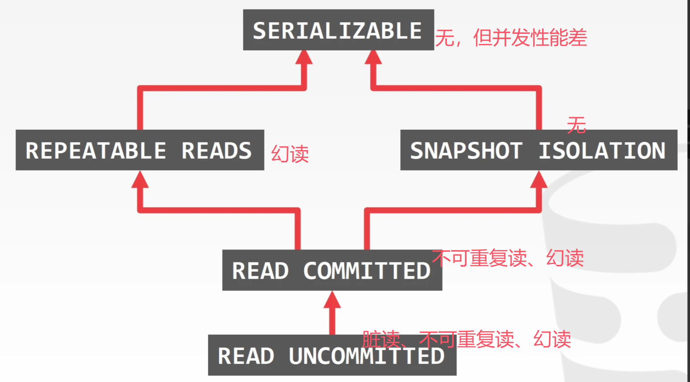

# MVCC事务概述

在存储引擎之上，我们来构建MVCC事务引擎，保证事务ACID的特性。

## 事务

详见这里的[笔记](https://github.com/1517005260/nowcoder/blob/master/help/3-CoreFunctions/4-TransactionManagement.md)

隔离性是最复杂的特性，因为涉及到了并发，我们主要的精力也在隔离性的实现上。

### 隔离性的实现

1. **加锁**：最基本的隔离性方式，通过对数据的读写操作进行加锁来保证隔离性。一个事务中的操作分为获取锁和释放锁两个阶段。在获取锁阶段，事务只能不断获取新的锁，不能释放已有的锁；在释放锁阶段，事务只能逐渐释放锁，不能再获取新的锁。这样保证了事务的隔离性。

2. **Timestamp Ordering**：基于时间戳的隔离性方案。每个事务在开始时获取一个对应的时间戳，通过时间戳来决定事务的执行顺序。这种方式通过比较不同事务的时间戳来对事务进行排序，确保隔离性。

3. **MVCC（多版本并发控制）**（最常使用）：结合加锁和时间戳的方法。MVCC（Multi-Version Concurrency Control）通过保留数据的多个版本来实现更高的并发性。在现代数据库中，MVCC 是一种较为常见的隔离性实现方法，因为它允许事务在读取数据时不需要等待写操作完成，适合高并发场景。

## MVCC多版本并发控制（思路）

MVCC是一种通过在数据库中为每个事务生成数据的多个版本来实现并发控制的技术。通过保留历史数据版本，MVCC允许读取操作不需要锁定资源，从而可以在不锁定整个数据库的情况下并行读取和写入操作。这样，不同的事务可以访问相同数据的不同历史版本，从而减少了锁的需求，提高了并发性能。

MVCC 的核心思想：
1. **数据版本管理：** 每条数据（每行数据）会有多个版本，版本由时间戳或事务id标记。
2. **读写分离：** 读操作读取的是数据的某个一致性快照（视图），写操作是在创建新的数据版本。
3. **事务隔离：** 通过访问不同的数据版本，MVCC 可以实现事务的隔离性，从而满足不同隔离级别的要求。读事务可以访问提交前的数据版本，不需要等待写事务提交，从而保证了事务的隔离性和一致性。MVCC避免了脏读、不可重复读和幻读问题。

MVCC非常适合读操作远多于写操作的高并发场景中。

**与git类比**：读操作就是在读已经commit的节点数据，写操作就是开了个新分支，写完后合并到主分支上。

### 快照隔离（Snapshot Isolation）（实现）

快照隔离是一种基于 MVCC 实现的隔离级别。它提供了一种比可重复读更强的隔离级别，但比串行化稍弱。快照隔离的基本原理是，每个事务在开始时就会获得一个数据集的一个快照，并在整个事务期间使用这个快照进行读操作。

快照隔离的主要特点包括：

1. **一致性快照**：每个事务在开始时都会获得一份数据集的快照，使得该事务在事务期间不会看到其他事务的修改。
2. **写-写冲突检测**：虽然读取使用的是快照，但写操作在尝试提交时会检查是否有一条相同的写操作，如果有，则会产生冲突，从而一个事务必须回滚。
3. **避免读写冲突**：由于事务使用的是快照数据，事务间的读取操作不会因为其他事务的写操作而被阻塞，从而提高了系统的并发能力。

快照隔离能够有效避免大多数并发问题，但并不是完全串行化的隔离，可以避免脏读、不可重复读、幻读。

隔离级别如下图所示：

我们主要实现快照隔离机制。