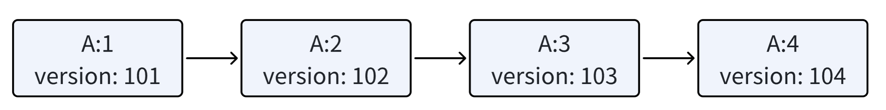

# 事务的开启与写数据

**MVCC实现**：

例如，对于update操作，我们不会直接修改源数据，而是保留历史数据，并增加版本号，类似于git：



**隔离实现**：

隔离的最终目标，是要在多个事务并发执行的过程中，让每个事务都觉得现在只有自己在运行，即让其它事务的修改对自己不可见，否则会造成脏读等问题。

实现机制和git差不多：快照就是获取了主分支上的一个节点，修改就是新开分支，从主分支节点1获取的分支是相互隔离的，就算事务5获取了节点1，事务1在之后提交，事务5的视角也仅是节点1，不是更改后的节点2。当事务5提交的时候，与节点2比较，有冲突的须选择一个rollback：

```
     Key   A    B    C   D
           a1   b1   c1  d1
Time
1          a2
2               b2
3                   del
4                          del
```

如上例，初始下，A=a1，B=b1，C=c1，D=d1，然后按时间1，2，3，4开启了四个事务。

现在新开事务5，则事务5视角下的活跃事务（未提交事务）列表就是`[1,2,3,4]`，就算列表里的事务提交了，修改对事务5仍然不可见。所以我们说，在事务开始后，获取的事务活跃列表，就是一个数据库的全局状态快照。

## 事务的开启

1. 获取全局版本号
2. 全局版本号++（例如获取到了版本号100，现在就修改为101）
3. 获取当前活跃事务，并维护一份私有活跃事务列表（每个事务手上的活跃事务列表会不一样）
4. 将当前事务设置为活跃事务，供后续其它新事务获取

### 代码实现

在mvcc.rs：

```rust
pub type Version = u64;  // 版本号

impl<E:Engine> Mvcc<E> {
    pub fn begin(&self) -> Result<MvccTransaction<E>>{   // 开启事务
        MvccTransaction::begin(self.engine.clone())  // 直接调用底层的事务实现
    }
}

pub struct MvccTransaction<E:Engine>{
  // 代表一个具体的事务
  engine: Arc<Mutex<E>>,
  state: TransactionState,
}

pub struct TransactionState{
  pub version: Version,  // 本事务版本号
  pub active_version: HashSet<Version>,  // 活跃事务对应的版本号
}

#[derive(Clone, Serialize, Deserialize)]
pub enum MvccKey{  // 和数据key类型区分
  NextVersion,   // 版本号
  ActiveTransactions(Version)  // 活跃事务，附有版本号
}

impl MvccKey{
  // 编码为二进制
  pub fn encode(&self) -> Vec<u8>{
    bincode::serialize(&self).unwrap()
  }

  // 解码二进制
  pub fn decode(data: Vec<u8>) -> Result<Self> {
    Ok(bincode::deserialize(&data)?)
  }
}

#[derive(Clone, Serialize, Deserialize)]
pub enum MvccKeyPrefix{  // MvccKey的前缀，用于扫描活跃事务
  NextVersion,   // 版本号前缀
  ActiveTransactions // 活跃事务前缀
}
impl MvccKeyPrefix {
  // 编码为二进制
  pub fn encode(&self) -> Vec<u8> {
    bincode::serialize(&self).unwrap()
  }
}

impl<E:Engine> MvccTransaction<E> {
  // 开启事务
  pub fn begin(engine: Arc<Mutex<E>>) -> Result<Self> {
    // 1. 获取存储引擎
    let mut engine= engine.lock()?;
    // 2. 获取全局版本号，这里需要特判：第一个事务的版本号是空值
    let next_version = match engine.get(MvccKey::NextVersion.encode()) {
      None => 1,
      Some(version) => bincode::deserialize(&version)?,
    };
    // 3. 全局版本号++
    engine.set(MvccKey::NextVersion.encode(), bincode::serialize(&(next_version + 1))?)?;
    // 4. 获取活跃事务列表
    let active_version = Self::scan_active_transactions(&mut engine)?;
    // 5. 将本事务添加到活跃事务列表
    engine.set(MvccKey::ActiveTransactions(next_version).encode(), vec![])?;  // 事务活跃列表数据存在key里，value存空值即可

    Ok(Self{
      engine: engine.clone(),
      state: TransactionState{
        version: next_version,
        active_version,
      }
    })
  }

  // 获取活跃事务辅助方法
  fn scan_active_transactions(eng: &mut MutexGuard<E>) -> Result<HashSet<Version>> {
    let mut res = HashSet::new();
    let mut iter = eng.prefix_scan(MvccKeyPrefix::ActiveTransactions.encode());
    while let Some((key, _)) = iter.next().transpose()? {  // key是二进制
      match MvccKey::decode(&key)? {
        MvccKey::ActiveTransactions(version) => {
          res.insert(version);
        },
        _ => Err(Error::Internal(format!("[Scan Active Transactions] Unexpected key {:?}", String::from_utf8(&key)))?)
      }
    }
    Ok(res)
  }
}
```

这里，我们需要理解寻找活跃事务的方法：

```rust
pub enum MvccKey{  
    NextVersion, 
    ActiveTransactions(Version) 
}
```

由于MvccKey是个枚举，在编码过程中，可能被编为：

```
NextVersion - 0x00
ActiveTransactions - 0x1001, 0x1002, 0x1003
```

所以我们需要扫描带有ActiveTransactions的前缀，来找到活跃事务的列表。


## 事务的写数据、删除数据

1. 检测冲突
- 数据所属的版本号在当前的活跃事务中，则不可见（不可修改）
- 数据所属的版本号小于本事务的版本号，则可见（可修改）
- 数据所属的版本号大于本事务的版本号，则不可见（不可修改）
  - 例如，现在事务5版本号为100，它可以修改版本号为99的数据a，但是若事务6的版本号是101，且先与版本5提交，则数据a的版本号变为101，那么事务5就不可以修改数据a

2. 写入数据
- 存储版本号对应key的信息（用于事务回滚）：version->key
- 对原来存储的kv对中的key进行编码，加入事务版本号，即 key-version -> value

### 代码实现

继续在mvcc.rs中：

```rust
impl TransactionState{
    fn is_visible(&self, version: Version) -> bool {
        if self.active_version.contains(&version) {
            false
        }else{
            version <= self.version
        }
    }
}

#[derive(Clone, Serialize, Deserialize)]
pub enum MvccKey{  // 和数据key类型区分
  NextVersion,   // 版本号
  ActiveTransactions(Version),  // 活跃事务版本号
  Write(Version, Vec<u8>),     // 事务写入了哪些key
  Version(Vec<u8>, Version),  // (key, 所属version)
}


impl<E:Engine> MvccTransaction<E> {
  pub fn set(&mut self, key:Vec<u8>, value:Vec<u8>) -> Result<()> {
    self.update(key, Some(value))
  }

  pub fn delete(&mut self, key: Vec<u8>) -> Result<()> {
    self.update(key, None)
  }

  // set-delete 通用逻辑
  fn update(&self, key:Vec<u8>, value:Option<Vec<u8>>) -> Result<()> {  // 删除时value置空即可
    // 1. 获取存储引擎
    let mut engine= self.engine.lock()?;
    // 2. 检测是否冲突
    let from = MvccKey::Version(key.clone(), self.state.active_version.iter().min().copied().unwrap_or(self.state.version+1)).encode();
    // from 是最小的活跃版本，若活跃版本为空则置为 本事务版本+1
    let to = MvccKey::Version(key.clone(), u64::MAX).encode();
    // to 涵盖最大可能版本
    if let Some((key, _)) = engine.scan(from..=to).last().transpose()?{  // 对于我要修改的key，我需要从from-to找到它的最新版本号
      match MvccKey::decode(&key)? {
        MvccKey::Version(_, version) => {
          // 要修改的key的version是否对本事务可见
          if !self.state.is_visible(version) {
            Err(Error::WriteConflict)
          }
        },
        _ => {
          Err(Error::Internal(format!(
            "[Transaction Update] Unexpected key: {:?}",
            String::from_utf8(&key)
          )))
        }
      }
    }?;
    // 3. 不冲突，写入数据
    // 3.1 记录本version写入了哪些key，用于回滚数据
    engine.set(MvccKey::Write(self.state.version, key.clone()), vec![])?;
    // 3.2 写入实际的key-value数据
    engine.set(MvccKey::Version(key.clone(), self.state.version).encode(), bincode::serialize(&value)?)?;
    Ok(())
  }
}
```

这里需要注意：我们新编码了：Version(Vec<u8>, Version),即：`0xKey101`字样，但是扫描时有如下逻辑：

```
现在活跃事务版本号： 3 4 5
当前事务版本号：6
事务345修改了： key1-3 key2-4 key3-5
我们仅需要找出比3更旧的事务，只有这类事务才对6可见。3-5正在修改，所以6不可见，比6大的事务也不可见。
```

这里还涉及到了新的自定义错误，在error.rs中新增：

```rust
// 自定义错误类型
#[derive(Debug, Clone, PartialEq)]
pub enum Error{
    Parse(String), // 在解析器阶段报错，内容为String的错误
    Internal(String),   // 在数据库内部运行时的报错
    WriteConflict(String),   // 事务写冲突
}
```

## 磁盘存储了什么？

总结一下目前存储的数据：

**日志记录（来自 DiskEngine）**:
- 头部（key_len、value_len）。
- 数据（key 和 Option<value>）。

**事务元数据（来自 MVCC 层）**:
- 下一个版本号:
  - 键：MvccKey::NextVersion.encode()
  - 值：序列化的 Version (u64)。
- 活跃事务:
  - 键：MvccKey::ActiveTransactions(version).encode() 表示每个活跃事务。
  - 值：空（vec![]）。
- 事务写操作:
  - 键：MvccKey::Write(version, key).encode() 表示每个事务中写入的键。
  - 值：空（vec![]）。
- 版本化键值对:
  - 键：MvccKey::Version(key, version).encode()
  - 值：序列化的 Option<Vec<u8>>，代表值或删除标记。