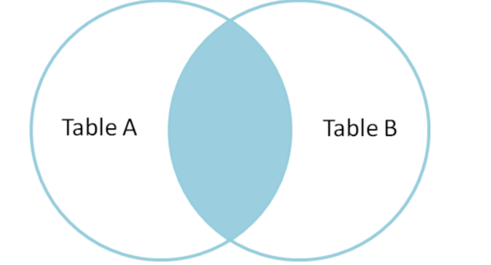
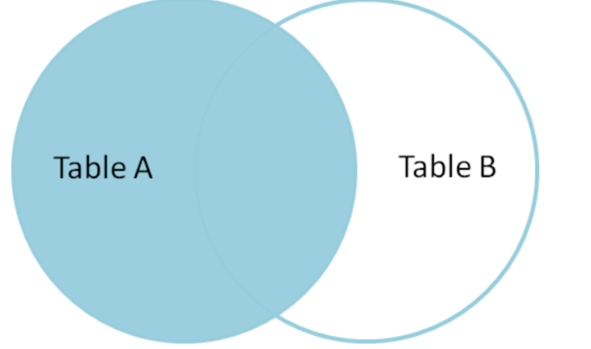
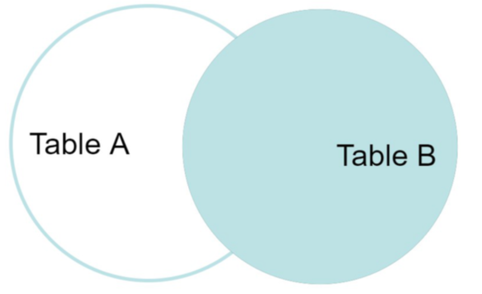

# Join 理论

常见的连接关系：Cross Join, (Inner) Join, Left/Right Join （也即Outer Join）。

平常用的`join`就是Inner Join。

### 示例

```sql
CREATE TABLE employees (
    employee_id INT PRIMARY KEY,
    employee_name VARCHAR(100),
    department_id INT
);

CREATE TABLE departments (
    department_id INT PRIMARY KEY,
    department_name VARCHAR(100)
);

CREATE TABLE projects (
    project_id INT PRIMARY KEY,
    project_name VARCHAR(100),
    department_id INT
);

INSERT INTO employees (employee_id, employee_name, department_id) VALUES
(1, 'Alice', 1),
(2, 'Bob', 1),
(3, 'Charlie', 2),
(4, 'David', NULL);

INSERT INTO departments (department_id, department_name) VALUES
(1, 'HR'),
(2, 'IT'),
(3, 'PR');

INSERT INTO projects (project_id, project_name, department_id) VALUES
(101, 'Project X', 1),
(102, 'Project Y', 2),
(103, 'Project Z', NULL);
```

#### `employees` 表：

| employee_id | employee_name | department_id |
|-------------|---------------|---------------|
| 1           | Alice         | 1             |
| 2           | Bob           | 1             |
| 3           | Charlie       | 2             |
| 4           | David         | NULL          |

#### `departments` 表：

| department_id | department_name |
|---------------|-----------------|
| 1             | HR              |
| 2             | IT              |
| 3             | PR              |

#### `projects` 表：

| project_id | project_name | department_id |
|------------|--------------|---------------|
| 101        | Project X    | 1             |
| 102        | Project Y    | 2             |
| 103        | Project Z    | NULL          |

## 常见Join类型

### Cross Join —— 笛卡尔积

X x Y

没有任何的外键连接条件。


例如：

```sql
select employee_name, department_name from employees cross join departments;
```

输出：

| employee_name | department_name |
|---------------|-----------------|
| Alice         | HR              |
| Bob           | HR              |
| Charlie       | HR              |
| David         | HR              |
| Alice         | IT              |
| Bob           | IT              |
| Charlie       | IT              |
| David         | IT              |
| Alice         | PR              |
| Bob           | PR              |
| Charlie       | PR              |
| David         | PR              |


### Inner Join 

运用外键求两张表的交集



例如：

```sql
SELECT e.employee_name, d.department_name
FROM employees e
JOIN departments d ON e.department_id = d.department_id;
```

输出：

| employee_name | department_name |
|---------------|-----------------|
| Alice         | HR              |
| Bob           | HR              |
| Charlie       | IT              |


### Left Join

须输出左表所有元素，即使右表为空（null）



例如：

```sql
SELECT e.employee_name, d.department_name
FROM employees e
LEFT JOIN departments d ON e.department_id = d.department_id;
```

输出：

| employee_name | department_name |
|---------------|-----------------|
| Alice         | HR              |
| Bob           | HR              |
| Charlie       | IT              |
| David         | NULL            |


### Right Join

须输出所有右表元素，即使左表为空（null）



例如：

```sql
SELECT e.employee_name, d.department_name
FROM employees e
RIGHT JOIN departments d ON e.department_id = d.department_id;
```

输出：

| employee_name | department_name |
|---------------|-----------------|
| Alice         | HR              |
| Bob           | HR              |
| Charlie       | IT              |
| NULL          | PR              |


### 多表连接

即将前一次的连接结果作为左表，依次和后续的表连接

例如：

```sql
SELECT e.employee_name, d.department_name, p.project_name
FROM employees e
JOIN departments d ON e.department_id = d.department_id
JOIN projects p on p.department_id = d.department_id;
```

输出：

| employee_name | department_name | project_name |
|---------------|-----------------|--------------|
| Alice         | HR              | Project X    |
| Bob           | HR              | Project X    |
| Charlie       | IT              | Project Y    |

## 数据库的Join语法规定

```sql
SELECT [* | col_name [ [ AS ] output_name [, ...] ]]
FROM from_item
[ORDER BY col_name [asc | desc] [, ...]]
[LIMIT count]
[OFFSET count]
```

**`from_item`** 为 `table_name` 或者 `table1_name join_type table2_name [on condition]`

**`join_type`** 为 Cross Join, Inner Join, Left Join, Right Join

**`on condition`** 为 `col1_name = col2_name`